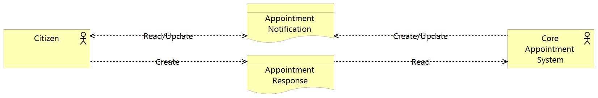

Appointments Service FHIR Implementation
========================================

Figure: Appointments Business Service

The appointments service provides an API for maintaining notifications
of appointments in the PHF. It is not an appointment booking service;
core systems perform booking and send appointment notifications, via the
Integration Hub, to the PHF. The API provides the ability for a CA to
record the citizen’s response to an appointment notification (accepted,
declined, tentative) and these responses are relayed back to the core
system where appropriate action can be taken.

FHIR Profiles
-------------

FHIR Profiles have been created and are included as an appendix. The
Access Control Engine (ACE) in the PHF uses the profile, which must be
specified in metadata, to make access control decisions based on scopes
contained within the OAuth2 Access Token. There are two relevant scopes
in the context of appointments: The first is **phfapi.admin** which
gives full access to the PHF and is used by the Integration Hub for CRUD
operations on appointments for any patient. The second is
**phfapi.appointments** which is used by the CA to respond and update
the status of appointments; this is limited access scope which grants
only the permitted operations for appointments relating to the
authenticated user.

DhpAppointment
~~~~~~~~~~~~~~

**Url**: https://digitalhealthplatform.scot/fhir/DhpAppointment

**Base Fhir Resource:** http://hl7.org/fhir/DSTU2/appointment.html

**Description**: The DhpAppointment resource is used to capture
appointment notification records for a patient. The term appointment
notification is adopted to differentiate these records from actual
appointments which are generated and stored in the core systems.
Appointment notifications provide a snapshot in time of a subset of data
from an appointment as it was generated in a core system. Citizens can
update their participant status (accept \| decline \| tentative) and
this is (optionally) fed back to the originating core system.

|image1|

Figure 1 DhpAppointment Element Tree

The following table is a `differential
statement <http://hl7.org/fhir/DSTU2/profiling.html#snapshot>`__ which
describes only the elements which have been modified from the base
profile. For a full description of all elements see also the FHIR
`Appointment <http://hl7.org/fhir/DSTU2/appointment.html>`__ structure
definition.

+-----------------------------------+-----------------------------------+
| **Attribute**                     | **Notes**                         |
+===================================+===================================+
| CorrelationIdentifier (slice of   | Core system unique appointment    |
| identifier)                       | identifier                        |
|                                   |                                   |
|                                   | A system+value pair uniquely      |
|                                   | identifiying the appointment in   |
|                                   | the originating core system.      |
|                                   | system is in the format           |
|                                   | https://digitalhealthplatform.sco |
|                                   | t/fhir/coresystems/{system        |
|                                   | identifier} e.g.                  |
|                                   | "https://digitalhealthplatform.sc |
|                                   | ot/fhir/coresystems/ggctrak"      |
+-----------------------------------+-----------------------------------+
| status                            | The overall status of the         |
|                                   | Appointment. Each of the          |
|                                   | participants has their own        |
|                                   | participation status which        |
|                                   | indicates their involvement in    |
|                                   | the process, however this status  |
|                                   | indicates the shared status. Any  |
|                                   | FHIR status is valid, however,    |
|                                   | only pending, booked and          |
|                                   | cancelled are currently acted     |
|                                   | upon. Any other status is not     |
|                                   | expected and will be ignored in   |
|                                   | the platform.                     |
+-----------------------------------+-----------------------------------+
| priority                          | profiled out                      |
+-----------------------------------+-----------------------------------+
| slot                              | profiled out                      |
+-----------------------------------+-----------------------------------+
| comment                           | Comments added by the service at  |
|                                   | the time the appointment is       |
|                                   | created, updated or cancelled.    |
|                                   | Comments must always append       |
|                                   | rather than overwrite previous    |
|                                   | comments and include a date/time  |
|                                   | when the comment was appended.    |
|                                   | Citizen comments are not added    |
|                                   | here but on the corresponding     |
|                                   | AppointmentResponse               |
+-----------------------------------+-----------------------------------+
| Citizen (slice of participant)    | Mandatory. A Patient resource     |
|                                   | which identifies the citizen for  |
|                                   | whom the appointment has been     |
|                                   | scheduled. A DhpAppointment can   |
|                                   | have any number of participants   |
|                                   | but one must be a reference to    |
|                                   | the citizen's own Patient         |
|                                   | resource.                         |
+-----------------------------------+-----------------------------------+
| OtherParticipants (slice of       | DhpAppointments must contain one  |
| participant)                      | participant of type Patient.      |
|                                   | Other participants are optional   |
|                                   | but if included must be added as  |
|                                   | contained resources whether       |
|                                   | Practitioner, RelatedPerson,      |
|                                   | Device, HealthCareService or      |
|                                   | Location.                         |
+-----------------------------------+-----------------------------------+

**FHIR Interactions**

+-----------------------+-----------------------+-----------------------+
| **Scope**             | **Interactions**      | **Constraints**       |
+=======================+=======================+=======================+
| phfapi.admin          | create, read, update, | none                  |
|                       | delete, create        |                       |
+-----------------------+-----------------------+-----------------------+
| phfapi.appointments   | read, update, search  | Citizen (i.e. a       |
|                       |                       | participant of type   |
|                       |                       | Patient) must         |
|                       |                       | reference the Patient |
|                       |                       | resource of the       |
|                       |                       | authorised user.      |
+-----------------------+-----------------------+-----------------------+

DhpAppointmentResponse
~~~~~~~~~~~~~~~~~~~~~~

**Url**: https://digitalhealthplatform.scot/fhir/DhpAppointmentResponse

**Base Fhir Resource:**
http://hl7.org/fhir/DSTU2/appointmentresponse.html

**Description**: Records a status change request.
DhpAppointmentResponses can trigger an update in the core appointment
system either electronically (using push notifications or history based
polling) or with manual intervention using an administration
application.

|image2|

Figure 2 DhpAppointmentResponse Element Tree

The following table is a `differential
statement <http://hl7.org/fhir/DSTU2/profiling.html#snapshot>`__ which
describes only the elements which have been modified from the base
profile. For a full description of all elements see also the FHIR
`AppointmentResponse <http://hl7.org/fhir/DSTU2/appointmentresponse.html>`__
structure definition.

+-----------------------------------+-----------------------------------+
| **Attribute**                     | **Notes**                         |
+===================================+===================================+
| identifier                        | If the DhpAppointment that this   |
|                                   | response is replying to had a     |
|                                   | core system unique identifier     |
|                                   | specified, then it is copied      |
|                                   | here. The core system appointment |
|                                   | identifier is a system+value pair |
|                                   | uniquely identifying the          |
|                                   | appointment in the originating    |
|                                   | core system. system is in the     |
|                                   | format                            |
|                                   | https://digitalhealthplatform.sco |
|                                   | t/fhir/coresystems/{system        |
|                                   | identifier} e.g.                  |
|                                   | "https://digitalhealthplatform.sc |
|                                   | ot/fhir/coresystems/ggctrak"      |
+-----------------------------------+-----------------------------------+
| start                             | profiled out - Start and end are  |
|                                   | not specified as specific         |
|                                   | alternate dates cannot be         |
|                                   | requested.                        |
+-----------------------------------+-----------------------------------+
| end                               | profiled out - Start and end are  |
|                                   | not specified as specific         |
|                                   | alternate dates cannot be         |
|                                   | requested.                        |
+-----------------------------------+-----------------------------------+
| participantType                   | profiled out                      |
+-----------------------------------+-----------------------------------+
| actor                             | Mandatory and must be the Patient |
|                                   | reference specified in the        |
|                                   | appointment being responded to.   |
+-----------------------------------+-----------------------------------+
| participantStatus                 | Participation status of the       |
|                                   | patient. Valid values from        |
|                                   | http://hl7.org/fhir/ValueSet/part |
|                                   | icipantstatus                     |
|                                   | are accepted, declined and        |
|                                   | tentative which is interpreted as |
|                                   | 'reschedule requested' and        |
|                                   | accompanied by optional comments  |
|                                   | - for example “I’m always         |
|                                   | unavailable on Mondays. Can I     |
|                                   | please have an appointment on a   |
|                                   | different day”.                   |
|                                   |                                   |
|                                   | Start and end are not specified   |
|                                   | as specific alternate dates       |
|                                   | cannot be requested.              |
|                                   |                                   |
|                                   | When a DhpAppointmentResponse is  |
|                                   | created, the participant and      |
|                                   | overall status of the             |
|                                   | DhpAppointment must also be       |
|                                   | updated accordingly within a      |
|                                   | transaction.                      |
|                                   |                                   |
|                                   | Participant status on the         |
|                                   | appointment also includes         |
|                                   | needs-action, which indicates     |
|                                   | that the patient has not yet      |
|                                   | responded and so this status will |
|                                   | never appear in                   |
|                                   | DhpAppointmentResponse.           |
+-----------------------------------+-----------------------------------+
| comment                           | A comment which is presented to   |
|                                   | the administrator who will        |
|                                   | reschedule or cancel the          |
|                                   | appointment.                      |
|                                   |                                   |
|                                   | This comment is particularly      |
|                                   | important when the responder is   |
|                                   | requesting another time to        |
|                                   | indicate unavailability.          |
+-----------------------------------+-----------------------------------+

**FHIR Interactions**

+-----------------------+-----------------------+-----------------------+
| **Scope**             | **Interactions**      | **Constraints**       |
+=======================+=======================+=======================+
| phfapi.admin          | read, search          | none                  |
+-----------------------+-----------------------+-----------------------+
| phfapi.appointments   | create, read, search  | Actor must reference  |
|                       |                       | the Patient resource  |
|                       |                       | of the authorised     |
|                       |                       | user.                 |
+-----------------------+-----------------------+-----------------------+

DhpAppointmentResponseTransaction
~~~~~~~~~~~~~~~~~~~~~~~~~~~~~~~~~

**Url**:
https://digitalhealthplatform.scot/fhir/DhpAppointmentResponseTransaction

**Base Fhir Resource:** http://hl7.org/fhir/DSTU2/bundle.html

**Description**: Citizens indicate a reponse to DhpAppointments by a)
creating a new DhpAppointmentResponse and b) updating the overall status
of the DhpAppointment. DhpAppointmentResponseTransaction provides a
means to apply both in a single atomic operation.

|image3|

Figure 3 DhpAppointmentResponseTransaction Element Tree

The following table is a `differential
statement <http://hl7.org/fhir/DSTU2/profiling.html#snapshot>`__ which
describes only the elements which have been modified from the base
profile. For a full description of all elements see also the FHIR
`Bundle <http://hl7.org/fhir/DSTU2/bundle.html>`__ structure definition.

+-----------------------------------+-----------------------------------+
| **Attribute**                     | **Notes**                         |
+===================================+===================================+
| type                              | Fixed value - transaction         |
+-----------------------------------+-----------------------------------+
| total                             | profiled out                      |
+-----------------------------------+-----------------------------------+
| link                              | profiled out                      |
+-----------------------------------+-----------------------------------+
| entry                             | Sliced - two entries must be      |
|                                   | provided; an Appointment relating |
|                                   | to the DhpAppointment being       |
|                                   | updated with request.method       |
|                                   | having fixed value 'PUT' and a    |
|                                   | DhpAppointmentResponse which is   |
|                                   | the response being recorded and   |
|                                   | has request.method fixed value    |
|                                   | 'POST'                            |
+-----------------------------------+-----------------------------------+
| signature                         | profiled out                      |
+-----------------------------------+-----------------------------------+

**FHIR Interactions**

+-----------------------+-----------------------+-----------------------+
| **Scope**             | **Interactions**      | **Constraints**       |
+=======================+=======================+=======================+
| phfapi.appointments   | create                | Actor must reference  |
|                       |                       | the Patient resource  |
|                       |                       | of the authorised     |
|                       |                       | user.                 |
+-----------------------+-----------------------+-----------------------+

.. _section-1:

Usage Scenarios
---------------

New Appointment
~~~~~~~~~~~~~~~

+-----------------------------------+-----------------------------------+
| Actor                             | Core Appointment system (via the  |
|                                   | IH)                               |
+===================================+===================================+
| Interaction                       | POST {fhir base}/Appointment      |
+-----------------------------------+-----------------------------------+
| Mandatory Requirements            | 1) `https://digitalhealthplatform |
|                                   | .scot/fhir/DhpAppointment         |
|                                   |    included in                    |
|                                   |    meta.profile <https://digitalh |
|                                   | ealthplatform.scot/fhir/DhpAppoin |
|                                   | tment%20included%20in%20meta.prof |
|                                   | ile>`__                           |
|                                   |                                   |
|                                   | 2) status = pending               |
|                                   |                                   |
|                                   | 3) description = brief subject    |
|                                   |    line                           |
|                                   |                                   |
|                                   | 4) start = appointment start      |
|                                   |    date/time                      |
|                                   |                                   |
|                                   | 5) At least one participant of    |
|                                   |    type Patient which is          |
|                                   |    reference to the Patient       |
|                                   |    resource of the person for     |
|                                   |    whom the appointment has been  |
|                                   |    made.                          |
|                                   |                                   |
|                                   | 6) patient participant status =   |
|                                   |    needs-action                   |
|                                   |                                   |
|                                   | 7) inform-subject meta tag added  |
|                                   |    as per Notifications Service   |
|                                   |    profile                        |
+-----------------------------------+-----------------------------------+
| Optional                          | 1) Correlation identifier added   |
|                                   |    (desirable)                    |
|                                   |                                   |
|                                   | 2) Additional business            |
|                                   |    identifiers                    |
|                                   |                                   |
|                                   | 3) Additional participants        |
|                                   |    (`Practitioner <http://hl7.org |
|                                   | /fhir/DSTU2/practitioner.html>`__ |
|                                   |  | `RelatedPerson <http://hl7.org |
|                                   | /fhir/DSTU2/relatedperson.html>`_ |
|                                   | _ | `Device <http://hl7.org/fhir/ |
|                                   | DSTU2/device.html>`__ | `Healthca |
|                                   | reService <http://hl7.org/fhir/DS |
|                                   | TU2/healthcareservice.html>`__\ \ |
|                                   | | \ `Location <http://hl7.org/fhi |
|                                   | r/DSTU2/location.html>`__)        |
|                                   |    added as contained resources   |
|                                   |                                   |
|                                   | 4) Any other attributes inherited |
|                                   |    from the base resource which   |
|                                   |    have not been profiled out.    |
+-----------------------------------+-----------------------------------+

Update Appointment
~~~~~~~~~~~~~~~~~~

+-----------------------------------+-----------------------------------+
| Actor                             | Core Appointment system (via the  |
|                                   | IH)                               |
+===================================+===================================+
| Interaction                       | PUT {fhir base}/Appointment/id    |
+-----------------------------------+-----------------------------------+
| Mandatory Requirements            | 1) `Change <https://digitalhealth |
|                                   | platform.scot/fhir/DhpAppointment |
|                                   | %20included%20in%20meta.profile>` |
|                                   | __                                |
|                                   |    details updated (e.g. time,    |
|                                   |    location)                      |
|                                   |                                   |
|                                   | 2) Comment appended with human    |
|                                   |    readable datestamp and brief   |
|                                   |    description – e.g.             |
|                                   |    why/what/who updated the       |
|                                   |    appointment                    |
|                                   |                                   |
|                                   | 3) inform-subject meta tag        |
|                                   |    re-applied if necessary.       |
|                                   |                                   |
|                                   | 4) Patient participant status set |
|                                   |    to needs-action                |
|                                   |                                   |
|                                   | 5) Updates must not be made after |
|                                   |    the appointment datetime has   |
|                                   |    passed.                        |
+-----------------------------------+-----------------------------------+

Cancel Appointment
~~~~~~~~~~~~~~~~~~

+-----------------------------------+-----------------------------------+
| Actor                             | Core Appointment system (via the  |
|                                   | IH)                               |
+===================================+===================================+
| Interaction                       | PUT {fhir base}/Appointment/id    |
+-----------------------------------+-----------------------------------+
| Mandatory Requirements            | 1) Appointment status = cancelled |
|                                   |                                   |
|                                   | 2) Comment appended with human    |
|                                   |    readable datestamp and brief   |
|                                   |    description – e.g.             |
|                                   |    why/what/who cancelled the     |
|                                   |    appointment                    |
|                                   |                                   |
|                                   | 3) inform-subject meta tag        |
|                                   |    re-applied if necessary.       |
|                                   |                                   |
|                                   | 4) Cancellation must not occur    |
|                                   |    after the appointment datetime |
|                                   |    has passed.                    |
+-----------------------------------+-----------------------------------+

Delete Appointment
~~~~~~~~~~~~~~~~~~

+-----------------------------------+-----------------------------------+
| Actor                             | Core Appointment system (via the  |
|                                   | IH)                               |
+===================================+===================================+
| Interaction                       | DELETE {fhir base}/Appointment/id |
+-----------------------------------+-----------------------------------+
| Mandatory Requirements            | None - Deleted means the provider |
|                                   | wants the appointment removed     |
|                                   | from the patients PHF (as in      |
|                                   | potential data quality issues)    |
+-----------------------------------+-----------------------------------+

Accept Appointment
~~~~~~~~~~~~~~~~~~

+-----------------------------------+-----------------------------------+
| Actor                             | Citizen (via a CA)                |
+===================================+===================================+
| Interaction                       | POST {fhir base}/Transaction      |
|                                   |                                   |
|                                   | Containing:                       |
|                                   |                                   |
|                                   | PUT {fhir base}/Appointment/id    |
|                                   |                                   |
|                                   | POST {fhir                        |
|                                   | base}/AppointmentResponse         |
+-----------------------------------+-----------------------------------+
| Mandatory Requirements            | 1) Bundle specifying              |
|                                   |    `https://digitalhealthplatform |
|                                   | .scot/fhir/DhpAppointmentResponse |
|                                   | Transaction                       |
|                                   |    in                             |
|                                   |    meta.profile <https://digitalh |
|                                   | ealthplatform.scot/fhir/DhpAppoin |
|                                   | tmentResponseTransaction%20in%20m |
|                                   | eta.profile>`__                   |
|                                   |                                   |
|                                   | 2) Type=transaction               |
|                                   |                                   |
|                                   | 3) two entries must be provided;  |
|                                   |    an Appointment relating to the |
|                                   |    DhpAppointment being updated   |
|                                   |    with request.method having     |
|                                   |    fixed value 'PUT' and a        |
|                                   |    DhpAppointmentResponse which   |
|                                   |    is the response being recorded |
|                                   |    and has request.method fixed   |
|                                   |    value 'POST'                   |
|                                   |                                   |
|                                   | 4) Appointment status is updated  |
|                                   |    to ‘Booked’                    |
|                                   |                                   |
|                                   | 5) Patient participant status     |
|                                   |    updated to ‘accepted’          |
|                                   |                                   |
|                                   | NOTE: As a business rule it is    |
|                                   | not valid to accept an            |
|                                   | appointment which has previously  |
|                                   | been cancelled or deleted or      |
|                                   | where participant status has      |
|                                   | previously been set to accepted,  |
|                                   | declined or tentative. In other   |
|                                   | words, the appointment status     |
|                                   | must be ‘pending’ and the         |
|                                   | participant status must be        |
|                                   | ‘needs-action’                    |
+-----------------------------------+-----------------------------------+

Decline Appointment
~~~~~~~~~~~~~~~~~~~

+-----------------------------------+-----------------------------------+
| Actor                             | Citizen (via a CA)                |
+===================================+===================================+
| Interaction                       | POST {fhir base}/Transaction      |
|                                   |                                   |
|                                   | Containing:                       |
|                                   |                                   |
|                                   | PUT {fhir base}/Appointment/id    |
|                                   |                                   |
|                                   | POST {fhir                        |
|                                   | base}/AppointmentResponse         |
+-----------------------------------+-----------------------------------+
| Mandatory Requirements            | 1) Bundle specifying              |
|                                   |    `https://digitalhealthplatform |
|                                   | .scot/fhir/DhpAppointmentResponse |
|                                   | Transaction                       |
|                                   |    in                             |
|                                   |    meta.profile <https://digitalh |
|                                   | ealthplatform.scot/fhir/DhpAppoin |
|                                   | tmentResponseTransaction%20in%20m |
|                                   | eta.profile>`__                   |
|                                   |                                   |
|                                   | 2) Type=transaction               |
|                                   |                                   |
|                                   | 3) two entries must be provided;  |
|                                   |    an Appointment relating to the |
|                                   |    DhpAppointment being updated   |
|                                   |    with request.method having     |
|                                   |    fixed value 'PUT' and a        |
|                                   |    DhpAppointmentResponse which   |
|                                   |    is the response being recorded |
|                                   |    and has request.method fixed   |
|                                   |    value 'POST'                   |
|                                   |                                   |
|                                   | 4) Appointment status is updated  |
|                                   |    to ‘pending’                   |
|                                   |                                   |
|                                   | 5) Patient participant status     |
|                                   |    updated to ‘declined’          |
|                                   |                                   |
|                                   | NOTE: As a business rule it is    |
|                                   | not valid to decline an           |
|                                   | appointment which has previously  |
|                                   | been cancelled or deleted or      |
|                                   | where participant status has      |
|                                   | previously been set to declined   |
|                                   | or tentative. It **is** possible  |
|                                   | to decline an appointment that    |
|                                   | has previously been accepted. In  |
|                                   | other words, to decline, the      |
|                                   | appointment status must be        |
|                                   | ‘pending’ or ‘booked’ and the     |
|                                   | participant status must be        |
|                                   | ‘needs-action’ or ‘accepted’      |
+-----------------------------------+-----------------------------------+

Reschedule Appointment
~~~~~~~~~~~~~~~~~~~~~~

+-----------------------------------+-----------------------------------+
| Actor                             | Citizen (via a CA)                |
+===================================+===================================+
| Interaction                       | POST {fhir base}/Transaction      |
|                                   |                                   |
|                                   | Containing:                       |
|                                   |                                   |
|                                   | PUT {fhir base}/Appointment/id    |
|                                   |                                   |
|                                   | POST {fhir                        |
|                                   | base}/AppointmentResponse         |
+-----------------------------------+-----------------------------------+
| Mandatory Requirements            | 1) Bundle specifying              |
|                                   |    `https://digitalhealthplatform |
|                                   | .scot/fhir/DhpAppointmentResponse |
|                                   | Transaction                       |
|                                   |    in                             |
|                                   |    meta.profile <https://digitalh |
|                                   | ealthplatform.scot/fhir/DhpAppoin |
|                                   | tmentResponseTransaction%20in%20m |
|                                   | eta.profile>`__                   |
|                                   |                                   |
|                                   | 2) Type=transaction               |
|                                   |                                   |
|                                   | 3) two entries must be provided;  |
|                                   |    an Appointment relating to the |
|                                   |    DhpAppointment being updated   |
|                                   |    with request.method having     |
|                                   |    fixed value 'PUT' and a        |
|                                   |    DhpAppointmentResponse which   |
|                                   |    is the response being recorded |
|                                   |    and has request.method fixed   |
|                                   |    value 'POST'                   |
|                                   |                                   |
|                                   | 4) Appointment status is updated  |
|                                   |    to ‘pending’                   |
|                                   |                                   |
|                                   | 5) Patient participant status     |
|                                   |    updated to ‘tentative’         |
|                                   |                                   |
|                                   | NOTE: As a business rule it is    |
|                                   | not valid to set status to        |
|                                   | tentative on an appointment which |
|                                   | has previously been cancelled or  |
|                                   | deleted or where participant      |
|                                   | status has previously been set to |
|                                   | declined or tentative. It **is**  |
|                                   | possible to specify tentative on  |
|                                   | an an appointment that has        |
|                                   | previously been accepted. In      |
|                                   | other words, to set to tentative, |
|                                   | the appointment status must be    |
|                                   | ‘pending’ or ‘booked’ and the     |
|                                   | participant status must be        |
|                                   | ‘needs-action’ or ‘accepted’      |
+-----------------------------------+-----------------------------------+

Summary of business rules for allowed responses
~~~~~~~~~~~~~~~~~~~~~~~~~~~~~~~~~~~~~~~~~~~~~~~

+----------------------------------+--------+---------+--------------------+
| Available Responses              | Accept | Decline | Request Reschedule |
+==================================+========+=========+====================+
| Status                           |        |         |                    |
+----------------------------------+--------+---------+--------------------+
| needs-action                     | Y      | Y       | Y                  |
+----------------------------------+--------+---------+--------------------+
| accepted                         | N      | Y       | Y                  |
+----------------------------------+--------+---------+--------------------+
| declined                         | N      | N       | N                  |
+----------------------------------+--------+---------+--------------------+
| tentative (reschedule requested) | N      | N       | N                  |
+----------------------------------+--------+---------+--------------------+
| cancelled                        | N      | N       | N                  |
+----------------------------------+--------+---------+--------------------+
| deleted                          | N      | N       | N                  |
+----------------------------------+--------+---------+--------------------+

Appendix I – FHIR Profiles
--------------------------

Download Forge from https://simplifier.net/forge/download to view these
profiles.

Appendix II – Examples
----------------------

tbc

Appendix IV – C# Examples
-------------------------

tbc

.. |image0| image:: media/image1.png
   :width: 6.26806in
   :height: 1.10208in
.. |image1| image:: media/image2.png
   :width: 5.75in
   :height: 6.33333in
.. |image2| image:: media/image3.png
   :width: 5.975in
   :height: 4.73333in
.. |image3| image:: media/image4.png
   :width: 5.625in
   :height: 6.46667in
