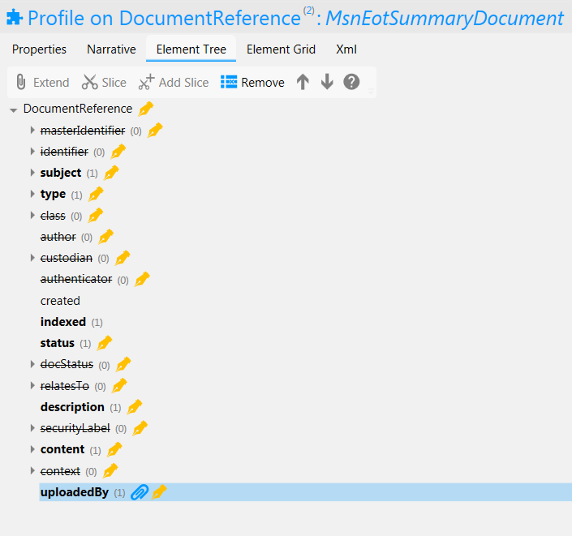

Correspondence Service FHIR Implementation
==========================================

.. figure:: ../../img/CorrespondenceBusService.png
   :scale: 50 %
   :alt: Correspondence Service

Figure 1: Correspondence Service

The service currently uses two FHIR resources which are used in different scenarios: the first is DocumentReference which contains one or more Attachments. Attachments contain either encoded data inline (any data with a MIME type but commonly pdf) OR a url reference to where the encoded data can be obtained. This type of correspondence declares conformance to profile https://digitalhealthplatform.scot/fhir/DhpCorrespondenceDocument. Also in use for the Managed Service Network for Children and Young People with Cancer (MSNCYPC) project are 7 additional profiles of DocumentReference which follow the same model. For these an extension is also defined which allows the username of the Keyworker who uploaded the document to be recorded.
The second FHIR resource used for correspondence is Communication. These are used within MSNCYPC to send short text-only notes between patients and the MSN service (and vice versa). As with documents, the means for relaying the messages between sender and recipient are currently outside the scope of the Correspondence Service.

For a business level description of the forms service see section "*Correspondence Business Service*" of this documentation.

FHIR Profiles
-------------

FHIR Profiles have been created and are available to download from this page. The
Access Control Engine (ACE) in the PHF uses the profile, which must be
specified in metadata, to make access control decisions based on scopes
contained within the OAuth2 Access Token. In the current implementation scope **phfapi.admin** 
is required to perform any CRUD operation on a form.

DhpCorrespondenceDocument
~~~~~~~~~~~~~~~~~~~~~~~~~

**FHIR Profile:** :download:`https://digitalhealthplatform.scot/fhir/DhpCorrespondenceDocument <Profiles/DhpCorrespondenceDocument.structuredefinition.xml>`

**Base Fhir Resource:** http://hl7.org/fhir/DSTU2/documentreference.html

**Description**: QuestionnaireResponse profile with set questions relating to the 'About Me' form used within the Patient Portal PoV project. Resources conforming to this profile are created when the Patient completes the About Me form page in the Portal. The resources are then available to be read by statutory systems for sharing with relevant clinicians.

.. figure:: ../../img/DhpCorrespondenceDocument_forge.png
   :scale: 75 %
   :alt: DhpCorrespondenceDocument Element Tree

Figure2: DhpCorrespondenceDocument Element Tree

The following table is a `differential
statement <http://hl7.org/fhir/DSTU2/profiling.html#snapshot>`__ which
describes only the elements which have been modified from the base
profile. For a full description of all elements see also the FHIR
`DocumentReference <http://hl7.org/fhir/DSTU2/documentreference.html>`__ structure
definition.

+-----------------------------------+---------------------------------------------------+
| **Attribute**                     | **Notes**                                         |
+===================================+===================================================+
|                                   |                                                   |
|                                   |                                                   |
+-----------------------------------+---------------------------------------------------+
|                                   |                                                   |
+-----------------------------------+---------------------------------------------------+

**FHIR Interactions**

+-----------------------+-----------------------+-----------------------+
| **Scope**             | **Interactions**      | **Constraints**       |
+=======================+=======================+=======================+
| phfapi.admin          | create, read, update, | none                  |
|                       | delete                |                       |
+-----------------------+-----------------------+-----------------------+

MsnDocument
~~~~~~~~~~~~~~~~~~~~~~~~~

**FHIR Profiles:** 

   :download:`https://www.youngcancer.scot.nhs.uk/fhir/MsnScanImage <Profiles/MsnScanImage.structuredefinition.xml>`
   
   :download:`https://www.youngcancer.scot.nhs.uk/fhir/MsnAppointmentDoc <Profiles/MsnAppointmentDoc.structuredefinition.xml>`
   :download:`https://www.youngcancer.scot.nhs.uk/fhir/MsnBloodResultDoc <Profiles/MsnBloodResultDoc.structuredefinition.xml>`
   :download:`https://www.youngcancer.scot.nhs.uk/fhir/MsnDiagnosisDoc <Profiles/MsnDiagnosisDoc.structuredefinition.xml>`
   :download:`https://www.youngcancer.scot.nhs.uk/fhir/MsnEotSummaryDoc <Profiles/MsnEotSummaryDoc.structuredefinition.xml>`
   :download:`https://www.youngcancer.scot.nhs.uk/fhir/MsnLinksDoc <Profiles/MsnLinksDoc.structuredefinition.xml>`
   :download:`https://www.youngcancer.scot.nhs.uk/fhir/MsnTreatmentPlanDoc <Profiles/MsnTreatmentPlanDoc.structuredefinition.xml>`

**Base Fhir Resource:** http://hl7.org/fhir/DSTU2/documentreference.html

**Description**: Data in MSN is stored 7 different document types. A FHIR profile has been created for each type and is based upon the DocumentReference resource. 6 of the profiles are for PDF and 1 is for an image.
All documents are created by the Keyworker using an admin portal and read by the MSN app. Only One element tree image is shown below but the structure is the same for all types:

Figure2: MsnEotSummaryDocument Element Tree

The following table is a `differential
statement <http://hl7.org/fhir/DSTU2/profiling.html#snapshot>`__ which
describes only the elements which have been modified from the base
profile. For a full description of all elements see also the FHIR
`DocumentReference <http://hl7.org/fhir/DSTU2/documentreference.html>`__ structure
definition.

+-----------------------------------+---------------------------------------------------------------------+
| **Attribute**                     | **Notes**                                                           |
+===================================+=====================================================================+
| masterIdentifier                  | profiled out                                                        |
+-----------------------------------+---------------------------------------------------------------------+
| identifier                        | profiled out                                                        |
+-----------------------------------+---------------------------------------------------------------------+
| subject                           | Subject is mandatory and must reference a Patient                   |
|                                   | resource                                                            |
+-----------------------------------+---------------------------------------------------------------------+
| type                              | Type must be a fixed string. One of                                 |
|                                   |'MsnEotSummaryDoc', ‘MsnBloodResultDoc’,                             |
|                                   |’MsnAppointmentDoc’,’MsnDiagnosisDoc’,                               |
|                                   |‘MsnTreatmentPlanDoc’, ‘MsnLinksDoc’, ’MsnScanImg’                   |
|                                   |                                                                     |
+-----------------------------------+---------------------------------------------------------------------+
| class                             | profiled out                                                        |
+-----------------------------------+---------------------------------------------------------------------+
| author                            | profiled out                                                        |
+-----------------------------------+---------------------------------------------------------------------+
| custodian                         | profiled out                                                        |
+-----------------------------------+---------------------------------------------------------------------+
| authenticator                     | profiled out                                                        |
+-----------------------------------+---------------------------------------------------------------------+
| status                            | Fixed value 'current'                                               |
+-----------------------------------+---------------------------------------------------------------------+
| docStatus                         | profiled out                                                        |
+-----------------------------------+---------------------------------------------------------------------+
| relatesTo                         | profiled out                                                        |
+-----------------------------------+---------------------------------------------------------------------+
| description                       | A description must be specified, either manually                    |
|                                   | entered by a keyworker or generated by the Admin                    |
|                                   | portal                                                              |
+-----------------------------------+---------------------------------------------------------------------+
| securityLabel                     | profiled out                                                        |
+-----------------------------------+---------------------------------------------------------------------+
| context                           | profiled out                                                        |
+-----------------------------------+---------------------------------------------------------------------+
| uploadedby                        | The username of the Key Worker who uploaded the                     |
|                                   | document. This is an extension of type                              |
|                                   | ''https://www.youngcancer.scot.nhs.uk/fhir/MsnUploadedByExtension'' |
|                                   | which defines a single string value ‘UploadedBy’.                   |
|                                   |                                                                     |
+-----------------------------------+---------------------------------------------------------------------+

**FHIR Interactions**

+-----------------------+-----------------------+-----------------------+
| **Scope**             | **Interactions**      | **Constraints**       |
+=======================+=======================+=======================+
| phfapi.admin          | create, read, update, | none                  |
|                       | delete                |                       |
+-----------------------+-----------------------+-----------------------+

Usage Scenarios
---------------

Scenario 1
~~~~~~~~~~

+-----------------------------------+-----------------------------------------------------------------+
| Actor                             | Care Organisation (via a CA)                                    |
+-----------------------------------+-----------------------------------------------------------------+
| Interaction                       | POST {fhir base}/QuestionnaireResponse                          |
+-----------------------------------+-----------------------------------------------------------------+
| Mandatory Requirements            | 1) ``https://digitalhealthplatform.scot/fhir/AboutMeResponse``  | 
|                                   |    included in meta.profile                                     |
|                                   |                                                                 |
|                                   | 2) subject = Patient who is the subject of the questions        |
|                                   |                                                                 |
|                                   | 3) status = in-progress                                         |
|                                   |                                                                 |                                
|                                   | 4) correct questions defined as per profile definition          |
|                                   |                                                                 |
|                                   | 5) inform-subject meta tag added                                |
|                                   |    as per Notifications Service                                 |
|                                   |    profile                                                      |
+-----------------------------------+-----------------------------------------------------------------+
| Optional                          | 1) Any attributes inherited                                     |
|                                   |    from the base resource which                                 |
|                                   |    have not been profiled out.                                  |
+-----------------------------------+-----------------------------------------------------------------+

Search
~~~~~~

+-----------------------------------+-----------------------------------------------------------------------+
| Actor                             | Citizen (via a CA)                                                    |
+-----------------------------------+-----------------------------------------------------------------------+
| Interaction                       | GET {fhir base}/QuestionnaireResponse                                 |
+-----------------------------------+-----------------------------------------------------------------------+
| Parameters                        | _profile=``https://digitalhealthplatform.scot/fhir/AboutMeResponse``  |
|                                   | subject={PHF id of subject's Patient resource}                        |
+-----------------------------------+-----------------------------------------------------------------------+
| Comments                          | Used to determine if a Patient has an AboutMe form associated with    |
|                                   | their account. A Patient can have only 1 AboutForm. A resultset count |
|                                   | of > 1 must be treated as an error condition.                         |
|                                   |                                                                       |      
+-----------------------------------+-----------------------------------------------------------------------+

Profile List
------------

:download:`https://digitalhealthplatform.scot/fhir/DhpCorrespondenceDocument <Profiles/DhpCorrespondenceDocument.structuredefinition.xml>`
:download:`https://www.youngcancer.scot.nhs.uk/fhir/MsnScanImage <Profiles/MsnScanImage.structuredefinition.xml>`
:download:`https://www.youngcancer.scot.nhs.uk/fhir/MsnAppointmentDoc <Profiles/MsnAppointmentDoc.structuredefinition.xml>`
:download:`https://www.youngcancer.scot.nhs.uk/fhir/MsnBloodResultDoc <Profiles/MsnBloodResultDoc.structuredefinition.xml>`
:download:`https://www.youngcancer.scot.nhs.uk/fhir/MsnDiagnosisDoc <Profiles/MsnDiagnosisDoc.structuredefinition.xml>`
:download:`https://www.youngcancer.scot.nhs.uk/fhir/MsnEotSummaryDoc <Profiles/MsnEotSummaryDoc.structuredefinition.xml>`
:download:`https://www.youngcancer.scot.nhs.uk/fhir/MsnLinksDoc <Profiles/MsnLinksDoc.structuredefinition.xml>`
:download:`https://www.youngcancer.scot.nhs.uk/fhir/MsnTreatmentPlanDoc <Profiles/MsnTreatmentPlanDoc.structuredefinition.xml>`
:download:`https://www.youngcancer.scot.nhs.uk/fhir/MsnNote <Profiles/MsnNote.structuredefinition.xml>`
:download:`https://www.youngcancer.scot.nhs.uk/fhir/MsnUploadedByExtension <Profiles/MsnUploadedByExtension.structuredefinition.xml>`

Download Forge from https://simplifier.net/forge/download to view this profile.

Examples
----------------------

C# Examples
-------------------------

            
