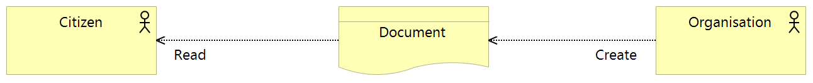
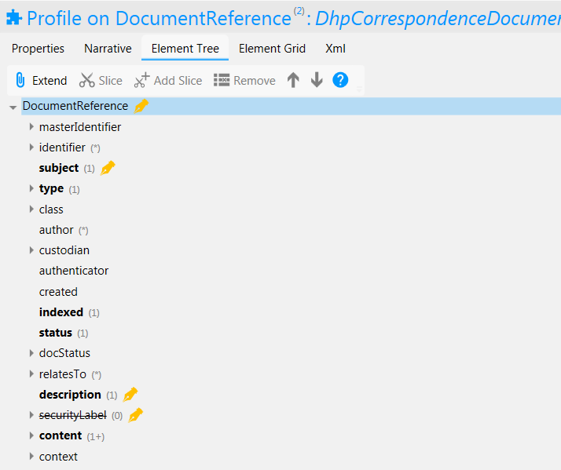

Correspondence Service FHIR Implementation
==========================================

Figure 1: Correspondence Service

The Correspondence service enables the electronic transmission of data between individuals or organisations which might otherwise be sent as a letter or other form of written communication. It differs from the "*Health and Care Information Business Service*" in that the information communicated is not necessarily structured and can include items such as a request to make an appointment, a notification that test results are available or supplementary information such as directions to a hospital.

For a business level description of the Correspondence service see section "*Correspondence Business Service*" of this documentation.

FHIR Profiles
-------------

FHIR Profiles have been created and are available to download from this page. The
Access Control Engine (ACE) in the PHF uses the profile, which must be
specified in metadata, to make access control decisions based on scopes
contained within the OAuth2 Access Token. In the current implementation scope **phfapi.admin** 
is required to perform any CRUD operation on correspondence.

DhpCorrespondenceDocument
~~~~~~~~~~~~~~~~~~~~~~~~~

**FHIR Profile:** :download:`https://digitalhealthplatform.scot/fhir/DhpCorrespondenceDocument <Profiles/DhpCorrespondenceDocument.structuredefinition.xml>`

**Base Fhir Resource:** http://hl7.org/fhir/DSTU2/documentreference.html

**Description**: DhpCorrespondenceDocument is used to record correspondence relating to the citizen.

Figure2: DhpCorrespondenceDocument Element Tree

The following table is a `differential
statement <http://hl7.org/fhir/DSTU2/profiling.html#snapshot>`__ which
describes only the elements which have been modified from the base
profile. For a full description of all elements see also the FHIR
`DocumentReference <http://hl7.org/fhir/DSTU2/documentreference.html>`__ structure
definition.

+-----------------------------------+---------------------------------------------------------------------+
| **Attribute**                     | **Notes**                                                           |
+===================================+=====================================================================+
| subject                           | Subject is mandatory and must reference a Patient                   |
|                                   | resource                                                            |
+-----------------------------------+---------------------------------------------------------------------+
| type                              | Type must be a fixed string? TODO: Requires clarification           |
+-----------------------------------+---------------------------------------------------------------------+
| description                       | Human-readable description of the source document. This is sometimes|
|                                   | known as the "title". A description must be specified, either       |
|                                   | manually entered by staff or generated by middleware.               |
+-----------------------------------+---------------------------------------------------------------------+
| securityLabel                     | profiled out                                                        |
+-----------------------------------+---------------------------------------------------------------------+

*Note:* As per the FHIR specification, the document itself is added as an `Attachment <http://hl7.org/fhir/DSTU2/datatypes.html#Attachment>`__ which can contain either the base64ed data inline or a URI pointing to a location where the document can be found on an external server. When a URI is specified, the CA must make an extra call to the external server to retrieve the document. The external URI will either require no authorisation or can authorise the call using an OAuth2 token issued by the DHP. In the case of the latter, the token issued to the CA for PHF interactions can be used, as the external service will trust the DHP token service. This is the only external authorisation mechansim currently supported.

**FHIR Interactions**

+-----------------------+-----------------------+-----------------------+
| **Scope**             | **Interactions**      | **Constraints**       |
+=======================+=======================+=======================+
| phfapi.admin          | create, read          | none                  |
+-----------------------+-----------------------+-----------------------+

Usage Scenarios
---------------

Create Correspondence
~~~~~~~~~~~~~~~~~~~~~

+-----------------------------------+---------------------------------------------------------------------------+
| Actor                             | Organisation                                                              |
+-----------------------------------+---------------------------------------------------------------------------+
| Interaction                       | POST {fhir base}/DocumentReference                                        |
+-----------------------------------+---------------------------------------------------------------------------+
| Mandatory Requirements            | 1) ``https://digitalhealthplatform.scot/fhir/DhpCorrespondenceDocument``  | 
|                                   |    included in meta.profile                                               |
|                                   |                                                                           |
|                                   | 2) subject = Patient who is the subject of the correspondence             |
|                                   |                                                                           |
|                                   | 3) status = 'current'                                                     |
|                                   |                                                                           |
|                                   | 4) type specified                                                         |
|                                   |                                                                           |
|                                   | 5) Human-readable description set                                         |
|                                   |                                                                           |
|                                   | 6) At least one content element with an attachment containing either      |
|                                   |    the actual base64-cocoded data or a uri where the data can be found    |
|                                   |                                                                           |
|                                   | 7) inform-subject meta tag added                                          |
|                                   |    as per Notifications Service                                           |
|                                   |    profile                                                                |
+-----------------------------------+---------------------------------------------------------------------------+
| Optional                          | 1) Any attributes inherited                                               |
|                                   |    from the base resource which                                           |
|                                   |    have not been profiled out.                                            |
+-----------------------------------+---------------------------------------------------------------------------+

Read
~~~~

+-----------------------------------+-----------------------------------------------------------------------+
| Actor                             | Citizen                                                               |
+-----------------------------------+-----------------------------------------------------------------------+
| Interaction                       | GET {fhir base}/DocumentReference/id                                  |
+-----------------------------------+-----------------------------------------------------------------------+
| Comments                          | Used when the id of the DocumentReference is known,                   |
|                                   | probably by performing a search operation prior to this call.         |    
+-----------------------------------+-----------------------------------------------------------------------+

Search
~~~~~~

+-----------------------------------+---------------------------------------------------------------------------------+
| Actor                             | Citizen                                                                         |
+-----------------------------------+---------------------------------------------------------------------------------+
| Interaction                       | GET {fhir base}/DocumentReference                                               |
+-----------------------------------+---------------------------------------------------------------------------------+
| Parameters                        | 1) _profile=`https://digitalhealthplatform.scot/fhir/DhpCorrespondenceDocument` |
|                                   | 2) subject={PHF id of subject's Patient resource}                               |
+-----------------------------------+---------------------------------------------------------------------------------+
| Comments                          | Used to return all correspondence for a patient.                                |
+-----------------------------------+---------------------------------------------------------------------------------+

Profile List
------------

:download:`https://digitalhealthplatform.scot/fhir/DhpCorrespondenceDocument <Profiles/DhpCorrespondenceDocument.structuredefinition.xml>`

Download Forge from https://simplifier.net/forge/download to view this profile.

Json Example
------------

.. code-block:: json

 {
        "resourceType": "DocumentReference",
        "id": "spark10",
        "meta": {
          "versionId": "spark61",
          "lastUpdated": "2018-03-02T11:15:16.864+00:00",
          "profile": [
            "https://digitalhealthplatform.scot/fhir/DhpCorrespondenceDocument"
          ],
          "tag": [
            {
              "system": "https://digitalhealthplatform.scot/fhir/tags",
              "code": "subject-informed"
            }
          ]
        },
        "subject": {
          "reference": "https://phfapi.ppedigitalhealthplatform.net/fhir/Patient/spark10"
        },
        "created": "2018-01-08T10:53:08.6119632Z",
        "indexed": "2018-01-08T10:53:08.611+00:00",
        "status": "current",
        "description": "Emergency Discharge Letter - Cardiology",
        "content": [
          {
            "attachment": {
              "contentType": "application/pdf",
              "data": "<base64-encoded string>",
              "title": "Emergency Discharge Letter - Cardiology"
            }
          }
        ]
      }

C# Example
----------

.. code-block:: c#

            DocumentReference docref = new DocumentReference
            {
                Description = "SampleCA Letter. This letter has not been viewed.",
                Indexed = DateTime.Now,
                Created = new FhirDateTime(DateTime.Now).Value,
                Status = DocumentReferenceStatus.Current,
                Meta = new Meta() { Tag = new List<Coding>() { new Coding() { Code = "inform-subject", System = "https://digitalhealthplatform.scot/fhir/tags" } } },
                Content = new List<DocumentReference.ContentComponent>
                {
                    new DocumentReference.ContentComponent { Attachment = new Attachment { Data = GetExampleLetterPDF(), ContentType = "application/pdf", Title = "SampleCA Letter" } }
                },
                Subject = new ResourceReference { Reference = string.Format(CultureInfo.CurrentCulture, "Patient/{0}", GetPatientSparkId()) }
            };
            
