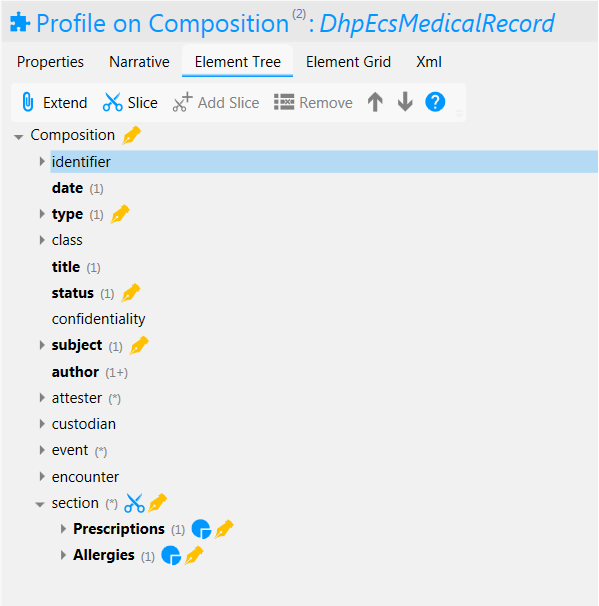

Health & Care Information Service FHIR Implementation
==========================================

.. figure:: ../../img/EcsBusService.png
   :scale: 50 %
   :alt: Health & Care Information Service

Figure 1: Health & Care Information Service

The Health and Care Information service enables citizens to view a copy of their data which is held by the health and care services. This is a view-only service and does not provide the ability to push amendments back to the feeding system.

Currently the technical capability exists to provide a copy of Allergy and Medications information from ECS. This uses a FHIR `Composition <http://hl7.org/fhir/DSTU2/composition.html>`__ with contained `AllergyIntolerence <http://hl7.org/fhir/DSTU2/allergyintolerance.html>`__ and `MedictionStatement <http://hl7.org/fhir/DSTU2/medicationstatement.html>`__ resources. 

For a business level description of the forms service see section "*Health & Care Information Business Service*" of this documentation.

FHIR Profiles
-------------

FHIR Profiles have been created and are available to download from this page. The
Access Control Engine (ACE) in the PHF uses the profile, which must be
specified in metadata, to make access control decisions based on scopes
contained within the OAuth2 Access Token. In the current implementation scope **phfapi.admin** 
is required to perform any CRUD operation on health and care information.

DhpEcsMedicalRecord
~~~~~~~~~~~~~~~~~~~

**FHIR Profile:** :download:`https://digitalhealthplatform.scot/fhir/DhpEcsMedicalRecord <Profiles/DhpEcsMedicalRecord.structuredefinition.xml>`

**Base Fhir Resource:** http://hl7.org/fhir/DSTU2/composition.html

**Description**: DhpEcsMedicalRecord is a profile based upon the Composition resource and is used to give structure to the contained resources (MedicationStement and AllergyIntolerence) to provide service users with a view of their summary record as known to their GP.

Figure2: DhpEcsMedicalRecord Element Tree

The following table is a `differential
statement <http://hl7.org/fhir/DSTU2/profiling.html#snapshot>`__ which
describes only the elements which have been modified from the base
profile. For a full description of all elements see also the FHIR
`Composition <http://hl7.org/fhir/DSTU2/composition.html>`__ structure
definition.

+-----------------------------------+----------------------------------------------------------------------------------------------+
| **Attribute**                     | **Notes**                                                                                    |
+===================================+==============================================================================================+
| subject                           | Subject is mandatory and must reference a Patient                                            |
|                                   | resource                                                                                     |
+-----------------------------------+----------------------------------------------------------------------------------------------+
| type                              | Type is mandatory and must specify a fixed value LOINC code 11503-0 (Medical Record)         |
+-----------------------------------+----------------------------------------------------------------------------------------------+
| status                            | The workflow/clinical status of this composition. Fixed value 'final' must be specified.     |
+-----------------------------------+----------------------------------------------------------------------------------------------+
| subject                           | Patient reference of the subject of the contained medical record                             |
+-----------------------------------+----------------------------------------------------------------------------------------------+
| section                           | Two sections are defined and must be specified, even if empty.                               |
|                                   | The sections are 'Prescriptions' and 'Allergies'                                             |
|                                   |                                                                                              |
|                                   | **Prescriptions**                                                                            |
|                                   | *title* is mandatory and has fixed value 'Prescriptions'                                     |
|                                   | *code* is mandatory and specifies LONC code 29549-3                                          |
|                                   | *entry* must be of type MedicationStatement and be contained within the Composition          |
|                                   |                                                                                              |
|                                   | **Allergies**                                                                                |
|                                   | *title* is mandatory and has fixed value 'Allergies'                                         |
|                                   | *code* is mandatory and specifies LONC code 48765-2                                          |
|                                   | *entry* must be of type AllergyIntolerence and be contained within the Composition           |
|                                   |                                                                                              |
+-----------------------------------+----------------------------------------------------------------------------------------------+

*Note:* Only one Composition conforming to profile DhpEcsMedicalRecord for each patient is allowed. Changes to the source system Medical Record are reflected as updates to the original composition.

**FHIR Interactions**

+-----------------------+-----------------------+-----------------------+
| **Scope**             | **Interactions**      | **Constraints**       |
+=======================+=======================+=======================+
| phfapi.admin          | create, read          | none                  |
+-----------------------+-----------------------+-----------------------+

Usage Scenarios
---------------

Create DhpEcsMedicalRecord
~~~~~~~~~~~~~~~~~~~~~~~~~~

+-----------------------------------+---------------------------------------------------------------------------+
| Actor                             | Organisation                                                              |
+-----------------------------------+---------------------------------------------------------------------------+
| Interaction                       | POST {fhir base}/Composition                                              |
+-----------------------------------+---------------------------------------------------------------------------+
| Mandatory Requirements            | 1) ``https://digitalhealthplatform.scot/fhir/DhpEcsMedicalRecord``        | 
|                                   |    included in meta.profile                                               |
|                                   |                                                                           |
|                                   | 2) subject = Patient who is the subject of the medical record             |
|                                   |                                                                           |
|                                   | 3) date = composition editing time                                        |
|                                   |                                                                           |
|                                   | 4) type = LOINC code 11503-0                                              |
|                                   |                                                                           |
|                                   | 5) title = 'Medical Record'                                               |
|                                   |                                                                           |
|                                   | 6) status = 'final'                                                       |
|                                   |                                                                           |
|                                   | 7) Prescriptions section added to *section*, even when no entries         |
|                                   |                                                                           |
|                                   | 8) Allergies section added to *section*, even when no entries             |
|                                   |                                                                           |
|                                   | 9) All MedicationStatement and AllergyIntrolence added as contained       |
|                                   |    resource and referenced accordingly                                    |
+-----------------------------------+---------------------------------------------------------------------------+
| Optional                          | 1) Any attributes inherited                                               |
|                                   |    from the base resource which                                           |
|                                   |    have not been profiled out.                                            |
+-----------------------------------+---------------------------------------------------------------------------+

Read
~~~~

+-----------------------------------+-----------------------------------------------------------------------+
| Actor                             | Citizen                                                               |
+-----------------------------------+-----------------------------------------------------------------------+
| Interaction                       | GET {fhir base}/Composition/id                                  |
+-----------------------------------+-----------------------------------------------------------------------+
| Comments                          | Used when the id of the Composition is known,                   |
|                                   | probably by performing a search operation prior to this call.         |    
+-----------------------------------+-----------------------------------------------------------------------+

Search
~~~~~~

+-----------------------------------+---------------------------------------------------------------------------------+
| Actor                             | Citizen                                                                         |
+-----------------------------------+---------------------------------------------------------------------------------+
| Interaction                       | GET {fhir base}/Composition                                                     |
+-----------------------------------+---------------------------------------------------------------------------------+
| Parameters                        | _profile=``https://digitalhealthplatform.scot/fhir/DhpCorrespondenceDocument``  |
|                                   | subject={PHF id of subject's Patient resource}                                  |
+-----------------------------------+---------------------------------------------------------------------------------+
| Comments                          | Used to return a single DhpEcsMedicalRecord for a patient.                      |
|                                   | If more than one resource is returned this must be treated as an error condition|
|                                   | and none of the available information should be presented to the user until     |
|                                   | until the situation is resolved.                                                |
+-----------------------------------+---------------------------------------------------------------------------------+

Profile List
------------

:download:`https://digitalhealthplatform.scot/fhir/DhpEcsMedicalRecord <Profiles/DhpEcsMedicalRecord.structuredefinition.xml>`

Download Forge from https://simplifier.net/forge/download to view this profile.

Examples
--------

.. code-block:: json

   {
      "fullUrl": "fhir_base/Composition/spark1/_history/spark8",
      "resource": {
        "resourceType": "Composition",
        "id": "spark1",
        "meta": {
          "versionId": "spark8",
          "lastUpdated": "2018-02-22T12:56:13.701+00:00"
        },
        "contained": [
          {
            "resourceType": "MedicationStatement",
            "id": "urn:uuid:5158f26a-17cf-11e8-9a20-525400fdb384",
            "patient": {
              "reference": "Patient/spark48"
            },
            "informationSource": {
              "display": "S99999"
            },
            "dateAsserted": "2017-12-07T09:00:00Z",
            "status": "active",
            "effectivePeriod": {
              "start": "2017-12-06"
            },
            "medicationCodeableConcept": {
              "coding": [
                {
                  "system": "urn:oid:2.16.840.1.113883.2.1.6.10",
                  "code": "404179005",
                  "display": "Ispaghula husk 3.5g effervescent granules sachets gluten ..., 28 sachet"
                }
              ],
              "text": "Ispaghula husk 3.5g effervescent granules sachets gluten ..., 28 sachet"
            },
            "dosage": [
              {
                "text": "ONE AT NIGHT"
              }
            ]
          },
          {
            "resourceType": "MedicationStatement",
            "id": "urn:uuid:515947d8-17cf-11e8-9a20-525400fdb384",
            "patient": {
              "reference": "Patient/spark48"
            },
            "informationSource": {
              "display": "S99999"
            },
            "dateAsserted": "2017-12-07T09:00:00Z",
            "status": "active",
            "effectivePeriod": {
              "start": "2017-11-15"
            },
            "medicationCodeableConcept": {
              "coding": [
                {
                  "system": "urn:oid:2.16.840.1.113883.2.1.6.10",
                  "code": "322280009",
                  "display": "Paracetamol 500mg capsules, 224 capsule"
                }
              ],
              "text": "Paracetamol 500mg capsules, 224 capsule"
            },
            "dosage": [
              {
                "text": "TWO CAPS FOUR TIMES A DAY FOR PAIN. INCREASED DOSE"
              }
            ]
          },
          {
            "resourceType": "AllergyIntolerance",
            "id": "urn:uuid:51679d7e-17cf-11e8-9a20-525400fdb384",
            "recordedDate": "2002-11-20",
            "recorder": {
              "display": "S99999"
            },
            "patient": {
              "reference": "Patient/spark48"
            },
            "substance": {
              "coding": [
                {
                  "system": "urn:oid:2.16.840.1.113883.2.1.6.2",
                  "code": "14L..00",
                  "display": "H/O: drug allergy, Bendroflumethiazide 2.5mg tablets"
                }
              ]
            },
            "note": {
              "text": "Likely Moderate Intolerance"
            }
          }
        ],
        "identifier": {
          "value": "Ensemble/ECS/2"
        },
        "date": "2018-02-22T17:58:21",
        "type": {
          "coding": [
            {
              "system": "http://loinc.org/",
              "code": "11503-0",
              "display": "Medical Record"
            }
          ]
        },
        "title": "Medical Record",
        "status": "final",
        "subject": {
          "reference": "fhir_base/Patient/spark48"
        },
        "author": [
          {
            "reference": "fhir_base/Device/NHSNSSHUB"
          }
        ],
        "custodian": {
          "reference": "fhir_base/Organization/NHSNSSIT"
        },
        "section": [
          {
            "title": "Prescriptions",
            "code": {
              "coding": [
                {
                  "system": "http://loinc.org/",
                  "code": "29549-3",
                  "display": "Medication administered Narrative"
                }
              ]
            },
            "text": {
              "status": "generated",
              "div": "
Medication administered Narrative.
"
            },
            "entry": [
              {
                "reference": "#urn:uuid:5158f26a-17cf-11e8-9a20-525400fdb384"
              },
              {
                "reference": "#urn:uuid:515947d8-17cf-11e8-9a20-525400fdb384"
              }
            ]
          },
          {
            "title": "Allergies",
            "code": {
              "coding": [
                {
                  "system": "http://loinc.org/",
                  "code": "48765-2",
                  "display": "Allergies and adverse reactions Document"
                }
              ]
            },
            "text": {
              "status": "generated",
              "div": "
Allergies and adverse reactions Document
"
            },
            "entry": [
              {
                "reference": "#urn:uuid:515eca0a-17cf-11e8-9a20-525400fdb384"
              },
              {
                "reference": "#urn:uuid:51679d7e-17cf-11e8-9a20-525400fdb384"
              }
            ]
          }
        ]
      }
    }

C# Examples
-------------------------

