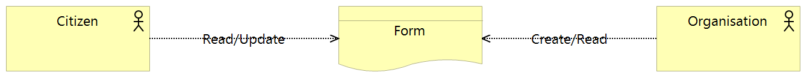
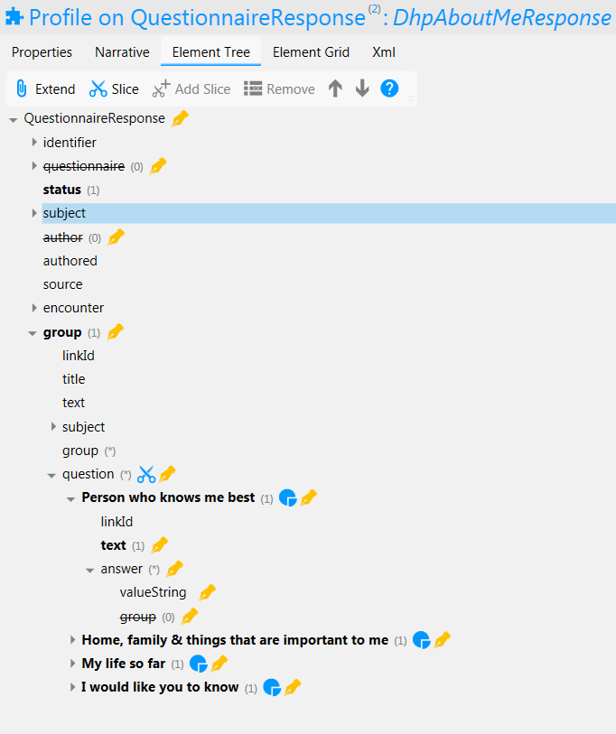

Forms Service FHIR Implementation
=================================

Figure 1: Forms Service

Forms are organised collections of questions intended to solicit information from citizens. The Forms Business Service enables users to answer set questions electronically and share those answers with relevant parties. 

Currently a single form is implemented called “About Me” which has a corresponding FHIR profile. FHIR profiles will be created on a one-to-one basis as new forms are added to the system - although a more genric profile may be created in future releases.

For a business level description of the forms service see section "*Forms Business Service*" of this documentation.

FHIR Profiles
-------------

FHIR Profiles have been created and are available to download from this page. The
Access Control Engine (ACE) in the PHF uses the profile, which must be
specified in metadata, to make access control decisions based on scopes
contained within the OAuth2 Access Token. In the current implementation scope **phfapi.admin** 
is required to perform any CRUD operation on a form.

AboutMeResponse
~~~~~~~~~~~~~~~

**FHIR Profile:** :download:`https://digitalhealthplatform.scot/fhir/AboutMeResponse <Profiles/AboutMeResponse.structuredefinition.xml>`

**Base Fhir Resource:** http://hl7.org/fhir/DSTU2/questionnaireresponse.html

**Description**: QuestionnaireResponse profile with set questions relating to the 'About Me' form used within the Patient Portal PoV project. Resources conforming to this profile are created when the Patient completes the About Me form page in the Portal. The resources are then transferred to SCI Store for sharing with relevant clinicians.

Figure2: AboutMeResponse Element Tree

The following table is a `differential
statement <http://hl7.org/fhir/DSTU2/profiling.html#snapshot>`__ which
describes only the elements which have been modified from the base
profile. For a full description of all elements see also the FHIR
`QuestionnaireResponse <http://hl7.org/fhir/DSTU2/questionnaireresponse.html>`__ structure
definition.

+-----------------------------------+-------------------------------------------+
| **Attribute**                     | **Notes**                                 |
+===================================+===========================================+
| questionnaire                     | profiled out. Only QuestionnaireResponse  |
|                                   | is used at present                        |
+-----------------------------------+-------------------------------------------+
| author                            | profiled out                              |
+-----------------------------------+-------------------------------------------+
| group                             | DhpAboutMeResponse defines a single       |
|                                   | group of questions                        |
+-----------------------------------+-------------------------------------------+
| Person who knows me best          | Mandatory. Text is fixed value            |
| (Slice of group.question)         | "Person who knows me best".               |
|                                   | answer type = valueString                 |
+-----------------------------------+-------------------------------------------+
| Home, family & things that are    | Mandatory. Text is fixed value            |
| important to me                   | "Home, family & things that are important to me". |
| (Slice of group.question)         | answer type = valueString                 |
+-----------------------------------+-------------------------------------------+
| My life so far                    | Mandatory. Text is fixed value            |
| (Slice of group.question)         | "My life so far".                         |
|                                   | answer type = valueString                 |
+-----------------------------------+-------------------------------------------+
| I would like you to know          | Mandatory. Text is fixed value            |
| (Slice of group.question)         | "I would like you to know".               |
|                                   | answer type = valueString                 |
+-----------------------------------+-------------------------------------------+
| Person who knows me best          | Mandatory. Text is fixed value            |
| (Slice of group.question)         | "Person who knows me best".               |
|                                   | answer type = valueString                 |
+-----------------------------------+-------------------------------------------+

**FHIR Interactions**

+-----------------------+-----------------------+-----------------------+
| **Scope**             | **Interactions**      | **Constraints**       |
+=======================+=======================+=======================+
| phfapi.admin          | create, read, update, | none                  |
|                       | delete, create        |                       |
+-----------------------+-----------------------+-----------------------+
| phfapi.appointments   | read, update, search  | Citizen (i.e. a       |
|                       |                       | participant of type   |
|                       |                       | Patient) must         |
|                       |                       | reference the Patient |
|                       |                       | resource of the       |
|                       |                       | authorised user.      |
+-----------------------+-----------------------+-----------------------+

Usage Scenarios
---------------

New Appointment
~~~~~~~~~~~~~~~

+-----------------------------------+-----------------------------------+
| Actor                             | Core Appointment system (via the  |
|                                   | IH)                               |
+===================================+===================================+
| Interaction                       | POST {fhir base}/Appointment      |
+-----------------------------------+-----------------------------------+
| Mandatory Requirements            | 1) `https://digitalhealthplatform |
|                                   | .scot/fhir/DhpAppointment         |
|                                   |    included in                    |
|                                   |    meta.profile <https://digitalh |
|                                   | ealthplatform.scot/fhir/DhpAppoin |
|                                   | tment%20included%20in%20meta.prof |
|                                   | ile>`__                           |
|                                   |                                   |
|                                   | 2) status = pending               |
|                                   |                                   |
|                                   | 3) description = brief subject    |
|                                   |    line                           |
|                                   |                                   |
|                                   | 4) start = appointment start      |
|                                   |    date/time                      |
|                                   |                                   |
|                                   | 5) At least one participant of    |
|                                   |    type Patient which is          |
|                                   |    reference to the Patient       |
|                                   |    resource of the person for     |
|                                   |    whom the appointment has been  |
|                                   |    made.                          |
|                                   |                                   |
|                                   | 6) patient participant status =   |
|                                   |    needs-action                   |
|                                   |                                   |
|                                   | 7) inform-subject meta tag added  |
|                                   |    as per Notifications Service   |
|                                   |    profile                        |
+-----------------------------------+-----------------------------------+
| Optional                          | 1) Correlation identifier added   |
|                                   |    (desirable)                    |
|                                   |                                   |
|                                   | 2) Additional business            |
|                                   |    identifiers                    |
|                                   |                                   |
|                                   | 3) Additional participants        |
|                                   |    (`Practitioner <http://hl7.org |
|                                   | /fhir/DSTU2/practitioner.html>`__ |
|                                   |  | `RelatedPerson <http://hl7.org |
|                                   | /fhir/DSTU2/relatedperson.html>`_ |
|                                   | _ | `Device <http://hl7.org/fhir/ |
|                                   | DSTU2/device.html>`__ | `Healthca |
|                                   | reService <http://hl7.org/fhir/DS |
|                                   | TU2/healthcareservice.html>`__\ \ |
|                                   | | \ `Location <http://hl7.org/fhi |
|                                   | r/DSTU2/location.html>`__)        |
|                                   |    added as contained resources   |
|                                   |                                   |
|                                   | 4) Any other attributes inherited |
|                                   |    from the base resource which   |
|                                   |    have not been profiled out.    |
+-----------------------------------+-----------------------------------+

Update Appointment
~~~~~~~~~~~~~~~~~~

+-----------------------------------+-----------------------------------+
| Actor                             | Core Appointment system (via the  |
|                                   | IH)                               |
+===================================+===================================+
| Interaction                       | PUT {fhir base}/Appointment/id    |
+-----------------------------------+-----------------------------------+
| Mandatory Requirements            | 1) `Change <https://digitalhealth |
|                                   | platform.scot/fhir/DhpAppointment |
|                                   | %20included%20in%20meta.profile>` |
|                                   | __                                |
|                                   |    details updated (e.g. time,    |
|                                   |    location)                      |
|                                   |                                   |
|                                   | 2) Comment appended with human    |
|                                   |    readable datestamp and brief   |
|                                   |    description – e.g.             |
|                                   |    why/what/who updated the       |
|                                   |    appointment                    |
|                                   |                                   |
|                                   | 3) inform-subject meta tag        |
|                                   |    re-applied if necessary.       |
|                                   |                                   |
|                                   | 4) Patient participant status set |
|                                   |    to needs-action                |
|                                   |                                   |
|                                   | 5) Updates must not be made after |
|                                   |    the appointment datetime has   |
|                                   |    passed.                        |
+-----------------------------------+-----------------------------------+

Cancel Appointment
~~~~~~~~~~~~~~~~~~

+-----------------------------------+-----------------------------------+
| Actor                             | Core Appointment system (via the  |
|                                   | IH)                               |
+===================================+===================================+
| Interaction                       | PUT {fhir base}/Appointment/id    |
+-----------------------------------+-----------------------------------+
| Mandatory Requirements            | 1) Appointment status = cancelled |
|                                   |                                   |
|                                   | 2) Comment appended with human    |
|                                   |    readable datestamp and brief   |
|                                   |    description – e.g.             |
|                                   |    why/what/who cancelled the     |
|                                   |    appointment                    |
|                                   |                                   |
|                                   | 3) inform-subject meta tag        |
|                                   |    re-applied if necessary.       |
|                                   |                                   |
|                                   | 4) Cancellation must not occur    |
|                                   |    after the appointment datetime |
|                                   |    has passed.                    |
+-----------------------------------+-----------------------------------+

Delete Appointment
~~~~~~~~~~~~~~~~~~

+-----------------------------------+-----------------------------------+
| Actor                             | Core Appointment system (via the  |
|                                   | IH)                               |
+===================================+===================================+
| Interaction                       | DELETE {fhir base}/Appointment/id |
+-----------------------------------+-----------------------------------+
| Mandatory Requirements            | None - Deleted means the provider |
|                                   | wants the appointment removed     |
|                                   | from the patients PHF (as in      |
|                                   | potential data quality issues)    |
+-----------------------------------+-----------------------------------+

Accept Appointment
~~~~~~~~~~~~~~~~~~

+-----------------------------------+-----------------------------------+
| Actor                             | Citizen (via a CA)                |
+===================================+===================================+
| Interaction                       | POST {fhir base}/Transaction      |
|                                   |                                   |
|                                   | Containing:                       |
|                                   |                                   |
|                                   | PUT {fhir base}/Appointment/id    |
|                                   |                                   |
|                                   | POST {fhir                        |
|                                   | base}/AppointmentResponse         |
+-----------------------------------+-----------------------------------+
| Mandatory Requirements            | 1) Bundle specifying              |
|                                   |    `https://digitalhealthplatform |
|                                   | .scot/fhir/DhpAppointmentResponse |
|                                   | Transaction                       |
|                                   |    in                             |
|                                   |    meta.profile <https://digitalh |
|                                   | ealthplatform.scot/fhir/DhpAppoin |
|                                   | tmentResponseTransaction%20in%20m |
|                                   | eta.profile>`__                   |
|                                   |                                   |
|                                   | 2) Type=transaction               |
|                                   |                                   |
|                                   | 3) two entries must be provided;  |
|                                   |    an Appointment relating to the |
|                                   |    DhpAppointment being updated   |
|                                   |    with request.method having     |
|                                   |    fixed value 'PUT' and a        |
|                                   |    DhpAppointmentResponse which   |
|                                   |    is the response being recorded |
|                                   |    and has request.method fixed   |
|                                   |    value 'POST'                   |
|                                   |                                   |
|                                   | 4) Appointment status is updated  |
|                                   |    to ‘Booked’                    |
|                                   |                                   |
|                                   | 5) Patient participant status     |
|                                   |    updated to ‘accepted’          |
|                                   |                                   |
|                                   | NOTE: As a business rule it is    |
|                                   | not valid to accept an            |
|                                   | appointment which has previously  |
|                                   | been cancelled or deleted or      |
|                                   | where participant status has      |
|                                   | previously been set to accepted,  |
|                                   | declined or tentative. In other   |
|                                   | words, the appointment status     |
|                                   | must be ‘pending’ and the         |
|                                   | participant status must be        |
|                                   | ‘needs-action’                    |
+-----------------------------------+-----------------------------------+

Decline Appointment
~~~~~~~~~~~~~~~~~~~

+-----------------------------------+-----------------------------------+
| Actor                             | Citizen (via a CA)                |
+===================================+===================================+
| Interaction                       | POST {fhir base}/Transaction      |
|                                   |                                   |
|                                   | Containing:                       |
|                                   |                                   |
|                                   | PUT {fhir base}/Appointment/id    |
|                                   |                                   |
|                                   | POST {fhir                        |
|                                   | base}/AppointmentResponse         |
+-----------------------------------+-----------------------------------+
| Mandatory Requirements            | 1) Bundle specifying              |
|                                   |    `https://digitalhealthplatform |
|                                   | .scot/fhir/DhpAppointmentResponse |
|                                   | Transaction                       |
|                                   |    in                             |
|                                   |    meta.profile <https://digitalh |
|                                   | ealthplatform.scot/fhir/DhpAppoin |
|                                   | tmentResponseTransaction%20in%20m |
|                                   | eta.profile>`__                   |
|                                   |                                   |
|                                   | 2) Type=transaction               |
|                                   |                                   |
|                                   | 3) two entries must be provided;  |
|                                   |    an Appointment relating to the |
|                                   |    DhpAppointment being updated   |
|                                   |    with request.method having     |
|                                   |    fixed value 'PUT' and a        |
|                                   |    DhpAppointmentResponse which   |
|                                   |    is the response being recorded |
|                                   |    and has request.method fixed   |
|                                   |    value 'POST'                   |
|                                   |                                   |
|                                   | 4) Appointment status is updated  |
|                                   |    to ‘pending’                   |
|                                   |                                   |
|                                   | 5) Patient participant status     |
|                                   |    updated to ‘declined’          |
|                                   |                                   |
|                                   | NOTE: As a business rule it is    |
|                                   | not valid to decline an           |
|                                   | appointment which has previously  |
|                                   | been cancelled or deleted or      |
|                                   | where participant status has      |
|                                   | previously been set to declined   |
|                                   | or tentative. It **is** possible  |
|                                   | to decline an appointment that    |
|                                   | has previously been accepted. In  |
|                                   | other words, to decline, the      |
|                                   | appointment status must be        |
|                                   | ‘pending’ or ‘booked’ and the     |
|                                   | participant status must be        |
|                                   | ‘needs-action’ or ‘accepted’      |
+-----------------------------------+-----------------------------------+

Reschedule Appointment
~~~~~~~~~~~~~~~~~~~~~~

+-----------------------------------+-----------------------------------+
| Actor                             | Citizen (via a CA)                |
+===================================+===================================+
| Interaction                       | POST {fhir base}/Transaction      |
|                                   |                                   |
|                                   | Containing:                       |
|                                   |                                   |
|                                   | PUT {fhir base}/Appointment/id    |
|                                   |                                   |
|                                   | POST {fhir                        |
|                                   | base}/AppointmentResponse         |
+-----------------------------------+-----------------------------------+
| Mandatory Requirements            | 1) Bundle specifying              |
|                                   |    `https://digitalhealthplatform |
|                                   | .scot/fhir/DhpAppointmentResponse |
|                                   | Transaction                       |
|                                   |    in                             |
|                                   |    meta.profile <https://digitalh |
|                                   | ealthplatform.scot/fhir/DhpAppoin |
|                                   | tmentResponseTransaction%20in%20m |
|                                   | eta.profile>`__                   |
|                                   |                                   |
|                                   | 2) Type=transaction               |
|                                   |                                   |
|                                   | 3) two entries must be provided;  |
|                                   |    an Appointment relating to the |
|                                   |    DhpAppointment being updated   |
|                                   |    with request.method having     |
|                                   |    fixed value 'PUT' and a        |
|                                   |    DhpAppointmentResponse which   |
|                                   |    is the response being recorded |
|                                   |    and has request.method fixed   |
|                                   |    value 'POST'                   |
|                                   |                                   |
|                                   | 4) Appointment status is updated  |
|                                   |    to ‘pending’                   |
|                                   |                                   |
|                                   | 5) Patient participant status     |
|                                   |    updated to ‘tentative’         |
|                                   |                                   |
|                                   | NOTE: As a business rule it is    |
|                                   | not valid to set status to        |
|                                   | tentative on an appointment which |
|                                   | has previously been cancelled or  |
|                                   | deleted or where participant      |
|                                   | status has previously been set to |
|                                   | declined or tentative. It **is**  |
|                                   | possible to specify tentative on  |
|                                   | an an appointment that has        |
|                                   | previously been accepted. In      |
|                                   | other words, to set to tentative, |
|                                   | the appointment status must be    |
|                                   | ‘pending’ or ‘booked’ and the     |
|                                   | participant status must be        |
|                                   | ‘needs-action’ or ‘accepted’      |
+-----------------------------------+-----------------------------------+

FHIR Profiles
--------------------------

:download:`https://digitalhealthplatform.scot/fhir/AboutMeResponse <Profiles/AboutMeResponse.structuredefinition.xml>`

Download Forge from https://simplifier.net/forge/download to view this profiles.

Examples
----------------------

tbc

C# Examples
-------------------------

tbc
