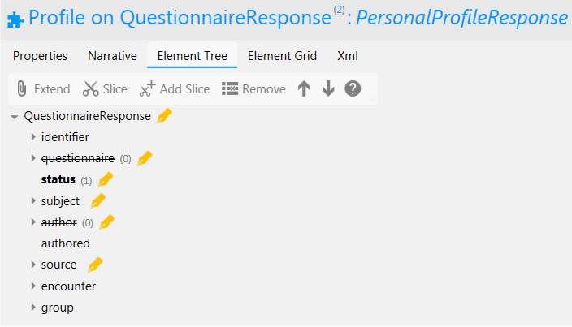

Forms Service FHIR Implementation
=================================

.. figure:: ../../img/FormsBusService.png
   :scale: 50 %
   :alt: Forms Service

Figure 1: Forms Service

Forms are organised collections of questions intended to solicit information from citizens. The Forms Business Service enables users to answer set questions electronically and share those answers with relevant parties. 

Currently two forms are implemented called “About Me” and "Personal Profile" which have corresponding FHIR profiles. FHIR profiles will be created on a one-to-one basis as new forms are added to the system. All forms follow the same general model - i.e. they define a profile on `QuestionnaireResponse <http://hl7.org/fhir/DSTU2/questionnaireresponse.html>`__, although small variations may exist, for example by the use of meta tags and extensions. In future iterations, a more generic mechanism could be introduced which would for example, use `Questionnaire <http://hl7.org/fhir/DSTU2/questionnaire.html>`__ resources rather than FHIR profiles.

For a business level description of the forms service see section "*Forms Business Service*" of this documentation.

FHIR Profiles
-------------

FHIR Profiles have been created and are available to download from this page. The
Access Control Engine (ACE) in the PHF uses the profile, which must be
specified in metadata, to make access control decisions based on scopes
contained within the OAuth2 Access Token. In the current implementation scope **phfapi.admin** 
is required to perform any CRUD operation on a form.

AboutMeResponse
~~~~~~~~~~~~~~~

**FHIR Profile:** :download:`https://digitalhealthplatform.scot/fhir/AboutMeResponse <Profiles/AboutMeResponse.structuredefinition.xml>`

**Base Fhir Resource:** http://hl7.org/fhir/DSTU2/questionnaireresponse.html

**Description**: QuestionnaireResponse profile with set questions relating to the 'About Me' form used within the Patient Portal PoV project. Resources conforming to this profile are created when the Patient completes the About Me form page in the Portal. The resources are then available to be read by statutory systems for sharing with relevant clinicians.

.. figure:: ../../img/AboutMeResponse_forge.png
   :scale: 75 %
   :alt: AboutMeResponse Element Tree

Figure2: AboutMeResponse Element Tree

The following table is a `differential
statement <http://hl7.org/fhir/DSTU2/profiling.html#snapshot>`__ which
describes only the elements which have been modified from the base
profile. For a full description of all elements see also the FHIR
`QuestionnaireResponse <http://hl7.org/fhir/DSTU2/questionnaireresponse.html>`__ structure
definition.

+-----------------------------------+---------------------------------------------------+
| **Attribute**                     | **Notes**                                         |
+===================================+===================================================+
| questionnaire                     | profiled out. Only QuestionnaireResponse          |
|                                   | is used at present                                |
+-----------------------------------+---------------------------------------------------+
| author                            | profiled out                                      |
+-----------------------------------+---------------------------------------------------+
| group                             | DhpAboutMeResponse defines a single               |
|                                   | group of questions                                |
+-----------------------------------+---------------------------------------------------+
| Person who knows me best          | Mandatory. Text is fixed value                    |
| (Slice of group.question)         | "Person who knows me best".                       |
|                                   | answer type = valueString                         |
+-----------------------------------+---------------------------------------------------+
| Home, family & things that are    | Mandatory. Text is fixed value                    |
| important to me                   | "Home, family & things that are important to me". |
| (Slice of group.question)         | answer type = valueString                         |
+-----------------------------------+---------------------------------------------------+
| My life so far                    | Mandatory. Text is fixed value                    |
| (Slice of group.question)         | "My life so far".                                 |
|                                   | answer type = valueString                         |
+-----------------------------------+---------------------------------------------------+
| I would like you to know          | Mandatory. Text is fixed value                    |
| (Slice of group.question)         | "I would like you to know".                       |
|                                   | answer type = valueString                         |
+-----------------------------------+---------------------------------------------------+

**FHIR Interactions**

+-----------------------+-----------------------+-----------------------+
| **Scope**             | **Interactions**      | **Constraints**       |
+=======================+=======================+=======================+
| phfapi.admin          | create, read, update, | none                  |
|                       | delete                |                       |
+-----------------------+-----------------------+-----------------------+

PersonalProfileResponse
~~~~~~~~~~~~~~~~~~~~~~~

**FHIR Profile:** :download:`https://digitalhealthplatform.scot/fhir/MyProfileResponse <Profiles/PersonalProfileResponse.structuredefinition.xml>`

**Base Fhir Resource:** http://hl7.org/fhir/DSTU2/questionnaireresponse.html

**Description**: QuestionnaireResponse profile with set questions relating to the 'Personal Profile' form used within the Patient Portal PoV project. Resources conforming to this profile are created when the Patient completes the Personal Profile form page in the Portal. Completed forms can be shared, with Patient consent, with their GP practice.

Figure3: PersonalProfileResponse Element Tree

The following table is a `differential
statement <http://hl7.org/fhir/DSTU2/profiling.html#snapshot>`__ which
describes only the elements which have been modified from the base
profile. For a full description of all elements see also the FHIR
`QuestionnaireResponse <http://hl7.org/fhir/DSTU2/questionnaireresponse.html>`__ structure
definition.

+-----------------------------------+------------------------------------------------------------------------------------------------+
| **Attribute**                     | **Notes**                                                                                      |
+===================================+================================================================================================+
| questionnaire                     | profiled out. Only QuestionnaireResponse                                                       |
|                                   | is used at present                                                                             |
+-----------------------------------+------------------------------------------------------------------------------------------------+
| staus                             | The lifecycle status of the questionnaire response as a whole. When the status is set to       |
|                                   | completed the form will be accessible by, or transferred to, the GP Practice. If the form is   |
|                                   | subsequently editied then the status moves to amended. The GP practice will not see updates to |
|                                   | the form until the status is returned to completed.                                            |
+-----------------------------------+------------------------------------------------------------------------------------------------+
| subject                           | The patient who this profile is about.                                                         |
+-----------------------------------+------------------------------------------------------------------------------------------------+
| author                            | profiled out                                                                                   |
+-----------------------------------+------------------------------------------------------------------------------------------------+
| source                            | The person who answered the questions about the subject. If set then the patient who is also   |
|                                   | the subject must be specified.                                                                 |
+-----------------------------------+------------------------------------------------------------------------------------------------+

**Questions**

Given the number of questions and complexity of rules around multi part answers, the questions have not been defined within the profile itself.

**GP Practice Code Meta Tag**

The system responsible for creating a PersonalProfileResponse resource for completion by the patient, must add the patient's GP Practice code which is used when routing the form to the correct practice. The format is:

.. code-block:: json

          "tag": [
            {
              "system": "https://digitalhealthplatform.scot/fhir/tags/GpPracticeCode",
              "code": "123456"
            }
          ]

**Version Extension**

To assist in document versioning by downstream systems en route to the GP Practice, a version number must be added and incremented everytime the form is shared (i.e. when the forms status is moved to completed - this can happen repeatedly if the patient chooses to edit their answers on a completed form). An extension has been defined for this purpose:

.. code-block:: json

        "extension": [
          {
            "url": "https://digitalhealthplatform.scot/fhir/MyProfileResponseVersionExtension",
            "valueInteger": 1
          }
        ]

**FHIR Interactions**

+-----------------------+-----------------------+-----------------------+
| **Scope**             | **Interactions**      | **Constraints**       |
+=======================+=======================+=======================+
| phfapi.admin          | create, read, update, | none                  |
|                       | delete                |                       |
+-----------------------+-----------------------+-----------------------+

Usage Scenarios
---------------

Create Form
~~~~~~~~~~~

+-----------------------------------+-----------------------------------------------------------------+
| Actor                             | Care Organisation (via a CA)                                    |
+-----------------------------------+-----------------------------------------------------------------+
| Interaction                       | POST {fhir base}/QuestionnaireResponse                          |
+-----------------------------------+-----------------------------------------------------------------+
| Mandatory Requirements            | 1) ``https://digitalhealthplatform.scot/fhir/AboutMeResponse``  | 
|                                   |    included in meta.profile                                     |
|                                   |                                                                 |
|                                   | 2) subject = Patient who is the subject of the questions        |
|                                   |                                                                 |
|                                   | 3) status = in-progress                                         |
|                                   |                                                                 |                                
|                                   | 4) correct questions defined as per profile definition          |
|                                   |                                                                 |
|                                   | 5) inform-subject meta tag added                                |
|                                   |    as per Notifications Service                                 |
|                                   |    profile                                                      |
+-----------------------------------+-----------------------------------------------------------------+
| Optional                          | 1) Any attributes inherited                                     |
|                                   |    from the base resource which                                 |
|                                   |    have not been profiled out.                                  |
+-----------------------------------+-----------------------------------------------------------------+

Update Form
~~~~~~~~~~~
+-----------------------------------+-----------------------------------------------------------------+
| Actor                             | Citizen (via a CA)                                              |
+-----------------------------------+-----------------------------------------------------------------+
| Interaction                       | PUT {fhir base}/QuestionnaireResponse/id                        |
+-----------------------------------+-----------------------------------------------------------------+
| Mandatory Requirements            | 1) ``https://digitalhealthplatform.scot/fhir/AboutMeResponse``  | 
|                                   |    included in meta.profile                                     |
|                                   |                                                                 |
|                                   | 2) subject = Patient who is the subject of the questions        |
|                                   |                                                                 |
|                                   | 3) status = in-progress OR completed                            |
|                                   |                                                                 |                                
|                                   | 4) correct questions defined as per profile definition          |
|                                   |                                                                 |
+-----------------------------------+-----------------------------------------------------------------+
| Optional                          | 1) Any attributes inherited                                     |
|                                   |    from the base resource which                                 |
|                                   |    have not been profiled out.                                  |
+-----------------------------------+-----------------------------------------------------------------+

Read Form
~~~~~~~~~

+-----------------------------------+-----------------------------------------------------------------+
| Actor                             | Citizen (via a CA)                                              |
+-----------------------------------+-----------------------------------------------------------------+
| Interaction                       | GET {fhir base}/QuestionnaireResponse/id                        |
+-----------------------------------+-----------------------------------------------------------------+
| Comments                          | Used when the id of the QuestionnaireResponse is known,         |
|                                   | probably by performing a search operation prior to this call.   |
+-----------------------------------+-----------------------------------------------------------------+

Search
~~~~~~

+-----------------------------------+-----------------------------------------------------------------------+
| Actor                             | Citizen (via a CA)                                                    |
+-----------------------------------+-----------------------------------------------------------------------+
| Interaction                       | GET {fhir base}/QuestionnaireResponse                                 |
+-----------------------------------+-----------------------------------------------------------------------+
| Parameters                        | 1) _profile=`https://digitalhealthplatform.scot/fhir/AboutMeResponse` |
|                                   | 2) subject={PHF id of subject's Patient resource}                     |
+-----------------------------------+-----------------------------------------------------------------------+
| Comments                          | Used to determine if a Patient has an AboutMe form associated with    |
|                                   | their account. A Patient can have only 1 AboutForm. A resultset count |
|                                   | of > 1 must be treated as an error condition.                         |
|                                   |                                                                       |      
+-----------------------------------+-----------------------------------------------------------------------+

Search (Poll for updates)
~~~~~~~~~~~~~~~~~~~~~~~~~

+-----------------------------------+-----------------------------------------------------------------------+
| Actor                             | Care Organisation (via the Hub)                                       |
+-----------------------------------+-----------------------------------------------------------------------+
| Interaction                       | GET {fhir base}/QuestionnaireResponse                                 |
+-----------------------------------+-----------------------------------------------------------------------+
| Parameters                        | 1) _profile=`https://digitalhealthplatform.scot/fhir/AboutMeResponse` |
|                                   | 2) status=completed                                                   |
|                                   | 3) _lastUpdated=gt{datetime of last poll}                             |
+-----------------------------------+-----------------------------------------------------------------------+
| Comments                          | Used by the party which issued the form to poll for updates.          |
|                                   | Forms with status=completed that have been updated since the last poll| 
|                                   | are returned                                                          |
+-----------------------------------+-----------------------------------------------------------------------+

Profile List
------------

:download:`https://digitalhealthplatform.scot/fhir/AboutMeResponse <Profiles/AboutMeResponse.structuredefinition.xml>`

Download Forge from https://simplifier.net/forge/download to view this profile.

Json Example
------------

.. code-block:: json

   {
     "resourceType": "QuestionnaireResponse",
     "meta": {
       "profile": [
         "https://digitalhealthplatform.scot/fhir/AboutMeResponse"
       ]
     },
     "text": {
       "status": "generated",
       "div": "

<h4>Person who knows me best</h4>
Jane Doe, 07453471176

<h4>Home, family and things that are important to me: your family, friends, pets or things about home</h4>
My cat Dollar, he's like a child to us. Great to have someone to cuddle.

<h4>My life so far: this may include your previous or present employment, interests, hobbies, important dates and events</h4>
Lorem Ipsum is simply dummy text of the printing and typesetting industry. Lorem Ipsum has been the industry's standard dummy text ever since the 1500s

<h4>I would like you to know: anything that will help the staff get to know you, perhaps things that help you relax or upset you</h4>
Lorem Ipsum is simply dummy text of the printing and typesetting industry. Lorem Ipsum has been the industry's standard dummy text ever since the 1500s

"
     },
     "status": "completed",
     "subject": {
       "reference": "Patient/spark43"
     },
     "authored": "2018-03-06T21:29:36.1009323Z",
     "source": {
       "reference": "Patient/spark43"
     },
     "group": {
       "question": [
         {
           "text": "Person who knows me best",
           "answer": [
             {
               "valueString": "Jane Doe, 07453471176"
             }
           ]
         },
         {
           "text": "Home, family & things that are important to me: your family, friends, pets or things about home",
           "answer": [
             {
               "valueString": "My cat Dollar, he's like a child to us. Great to have someone to cuddle."
             }
           ]
         },
         {
           "text": "My life so far: this may include your previous or present employment, interests, hobbies, important dates & events",
           "answer": [
             {
               "valueString": "Lorem Ipsum is simply dummy text of the printing and typesetting industry. Lorem Ipsum has been the     industry's standard dummy text ever since the 1500s"
             }
           ]
         },
         {
           "text": "I would like you to know: anything that will help the staff get to know you, perhaps things that help you relax or upset you",
           "answer": [
             {
               "valueString": "Lorem Ipsum is simply dummy text of the printing and typesetting industry. Lorem Ipsum has been the industry's standard dummy text ever since the 1500s"
             }
           ]
         }
       ]
     }
   }

C# Example
----------

.. code-block:: c#

            QuestionnaireResponse questionnaire = new QuestionnaireResponse
            {
                Subject = new ResourceReference { Reference = string.Format(CultureInfo.CurrentCulture, "Patient/{0}", GetPatientSparkId()) },
                Status = QuestionnaireResponseStatus.Completed,
                Group = new GroupComponent
                {
                    Question = new List<QuestionComponent>
                    {
                        new QuestionComponent{ Text="Person who knows me best",
                                Answer = new List<AnswerComponent>{ new AnswerComponent {  Value= new FhirString("Jane Doe, 07453471176")} } },
                        new QuestionComponent{ Text="Home, family & things that are important to me: your family, friends, pets or things about home",
                                Answer = new List<AnswerComponent>{ new AnswerComponent {  Value= new FhirString("My cat Dollar, he's like a child to us. Great to have someone to cuddle.")} } },
                        new QuestionComponent{ Text="My life so far: this may include your previous or present employment, interests, hobbies, important dates & events",
                                Answer = new List<AnswerComponent>{ new AnswerComponent {  Value= new FhirString("Lorem Ipsum is simply dummy text of the printing and typesetting industry. Lorem Ipsum has been the industry's standard dummy text ever since the 1500s") } } },
                        new QuestionComponent{ Text="I would like you to know: anything that will help the staff get to know you, perhaps things that help you relax or upset you",
                                Answer = new List<AnswerComponent>{ new AnswerComponent {  Value= new FhirString("Lorem Ipsum is simply dummy text of the printing and typesetting industry. Lorem Ipsum has been the industry's standard dummy text ever since the 1500s") } } },
                    }
                },
                AuthoredElement = FhirDateTime.Now(),
                Source = new ResourceReference { Reference = string.Format(CultureInfo.CurrentCulture, "Patient/{0}", GetPatientSparkId()) },
                Meta = new Meta() { Profile = new string[] { "https://digitalhealthplatform.scot/fhir/AboutMeResponse" } },
                Text= new Narrative { Status = Narrative.NarrativeStatus.Generated, Div=getQuestionnaireFragment()}
            };
            
