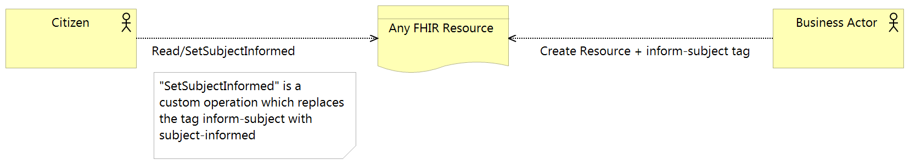

Notifications
=============

Figure 1: Notification Service

Notifications are the means by which citizens are informed, by the DHP, that a resource relating to them has been updated or added to the PHF. It is also possible that feeding systems send their own notifications (e.g. by email), but that is outside the scope of this service.

FHIR API implementation
-----------------------
FHIR meta tags are used to indicate which resources should trigger a notification and to indicate when the subject has been notified. An inform-subject tag is included with resources at the time of creation or update (by the IH) and this is replaced with a subject-informed tag by a CA when the notification has been delivered. It is currently up to the CA to implement the notification delivery mechanism.

A custom operation is defined, **$setSubjectInformed**, which provides a convenient way for a CA to indicate that the notification has been delivered. 

The structure of the inform-subject tag is:

.. code-block:: json

    "tag": [
      {
        "system": "https://digitalhealthplatform.scot/fhir/tags",
        "code": "inform-subject"
      }

Json Example
~~~~~~~~~~~~
Appointment with inform-subject tag applied:

.. code-block:: json

   {
     "resourceType": "Appointment",
     "meta": {
       "profile": [
         "https://digitalhealthplatform.scot/fhir/DhpAppointment"
       ],
       "tag": [
         {
           "system": "https://digitalhealthplatform.scot/fhir/tags",
           "code": "inform-subject"
         }
       ]
     },
     "status": "pending",
     "description": "Mr Bryn Jones - Orthopaedics",
     "start": "2018-03-23T21:21:27.75+00:00",
     "end": "2018-03-23T22:21:27.75+00:00",
     "comment": "13/03/2018 21:21:27 Appointment created from SampleCA.",
     "participant": [
       {
         "actor": {
           "reference": "Patient/spark43"
         },
         "status": "needs-action"
       }
     ]
   }

C# Example
~~~~~~~~~~
Setting subject-informed using custom instance operation:

.. code-block:: json

        private void SetNotificationViewed(string resourceType, string resourceId)
        {
            UriBuilder UriBuilderx = new UriBuilder(secureApiUrl);
            UriBuilderx.Path = string.Format(CultureInfo.CurrentCulture, "{0}/{1}", resourceType, resourceId);

            Client.InstanceOperation(UriBuilderx.Uri, "setSubjectInformed");
        }
