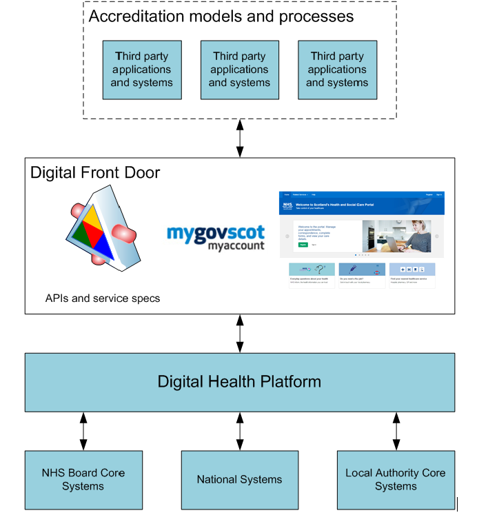
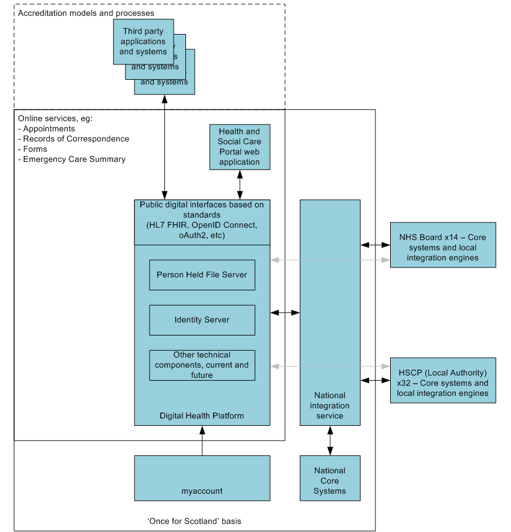

=============
Introduction
=============
This document contains an introductory overview of the Digital Health
Platform (DHP) in Scotland.

It is aimed at two types of parties who may want to connect to the
platform:

-  NHS, Local Authority and Government core system owners (CSO) who want
   to connect to the platform as a means to reach citizens via online
   channels at the cost of a single integration.

-  Third party providers (TPP) who want to connect their own
   applications to the platform as a component part of providing a
   citizen facing service. TPPs may be independent or commissioned by
   public sector agencies.

Contact for enquiries and suggested changes: <email of the platform
technical lead and/or platform service desk – must be able to fulfil any
enquiries, if need be via delegation>

(Please note that important platform principles are shown in italics in
the following text.)

What you can do with this platform
----------------------------------

**If you are a TPP** connecting to the platform then you can think of
accessing services via a Digital Front Door, see Figure 1 below.

By using your application, a service user will experience access to
public services via the Digital Front Door.

An application could be a browser based web application, a native mobile
app, a voice application linked to a digital assistant, or another type
of system. In the language of the platform this is referred to as a
'Consuming Application' (CA).

You will be able to rely on business and technical service
specifications whilst the complexity and detail of public sector systems
is taken care of behind the scenes.

*In order to connect, there will be an accreditation assessment of the
application by the DHP platform operator. *

*In addition, a service user will need to give explicit permission for a
connection during the running of your application. This permission may
need to be renewed from time to time, and can also be revoked. *

Figure 1: Digital Front Door

At the technical level the platform uses a set of technologies and
patterns that are common on the modern internet to provide access to
digital services.

In the case of the DHP, the Scottish myaccount is part of the access
control design. This will allow the platform to identify individuals
correctly.

*A myaccount authentication prompt will be presented by the platform
when a user is going through the process of approving a connection.*

**If you are a CSO** connecting to the platform then you can think of a
special type of national core system that lets you add a range of online
channels to your system, and lets you support associated innovation at
the cost of a single integration.

It is likely that the integration will make use of an integration engine
to translate between the native API of your core system and the API
standards used by the DHP, see Figure 2 below.

Figure 2: Outline platform architecture

In the language of the platform your core system is referred to as a
'Consuming Application' (CA). An integration engine may be a proxy and
would then also be seen as Consuming Application.

*In order to connect, it is important that you are able to support the
online channel from a business operation point of view. *

*As a core system owner, your system will generally be trusted by the
platform. In line with good security practice, access will be limited to
what is required for a given service and access can be revoked to
contain any security incidents. *

At the technical level you will use a set of technologies and patterns
that are common on the modern internet to provide access to digital
services. These are in fact the same mechanisms as for the Digital Front
Door that is seen by third parties.

The Scottish myaccount is part of the access control design. This will
allow the platform to identify individuals correctly when matching to
records that you hold in the core system.

*Service users will only be able to benefit from your online channel if
you verify their identities on the myaccount system, or if another
public service has already done so.*

Business service specifications
-------------------------------

The platform supports a set of business services which are specified in
separate documents.

The library of currently supported services can be found at: <URL of the
online documentation – in the short term we can share Word documents>

The service specifications are agnostic with respect to the underlying
public sector organisations and systems. For example, the appointment
service can equally support social care home visits and hospital
appointments.

*By using a given service as CSO or as TPP you enter into a set of
important commitments (the 'service contract') which is described in the
service specification. *

In general, this requires the implementations to be consistent with the
meanings defined by the service and for the implementations to be backed
by safe and effective real-life service fulfilment.

General platform features
-------------------------

The platform has a number of features which are available across a
number of business services. These are described in a separate document
on technical services.

In summary, these features currently cover:

1. Service user membership on the platform (via implicit or via
   administrative setup)

2. Ability to include a given piece of information in the notification
   feed of the service user and determine if the user has viewed the
   information

3. Ability to secure access to resources (both by the DHP operator and
   by the individual service user)

Future developments intend to cover:

1. Service user subscription to selected services

2. Push notifications from the platform when relevant information for a
   connected application becomes available

3. self-service features to substitute administrative effort

4. complex sharing of records amongst users

As a means to achieve scalability and enable standards-based
interoperability, the platform defines a way of working on a 'Once for
Scotland' basis.

*CSOs and TPPs must take responsibility for integrating their respective
systems with the platform, follow the related standards and
specifications, and implement adaptions such as mapping data.*

Accreditation and connection to the platform
--------------------------------------------

In order to connect to the platform, organisations need to establish a
business relationship and integrate systems. This is handled on a case
by case basis and follows the same approach that is currently taken for
any other kind of business and system integration project.

To support system integration, the technical services document describes
a few aspects of this which arise in the unique context of this
platform.

To support the wider service integration, it is necessary that the
platform operator and respective CSO or TPP join their support processes
and exchange corresponding contact details and such.

Furthermore, supporting work needs to be accounted for that happens
outside the platform but is a dependency for an overall service
implementation.

For example, the verification of user identities is a separate concern,
which the platform simply relies on. As long as a user presents with a
myaccount at sufficient Level of Assurance, the platform will provide
its services. It is a separate matter for CSO and TPPs to ensure that
their user population is in possession of such accounts and that their
identity was verified.

For the scenario of a TPP connecting to the platform, some aspects of
the connection process will eventually be described more specifically in
form of an accreditation process.

Given the level of sensitivity attached to the information, the
standards of work are relatively high and all parties should expect to
work with formal contracts, data sharing agreements, data processor
agreements, Privacy Impact Assessments, System Security Policies/Risk
Management Documents.

*All parties need to provide evidence at their own expense and support
regular audit and re-accreditation to allow confidence in a safe
operation and in the ability to meet the commitments of service
contracts.*
